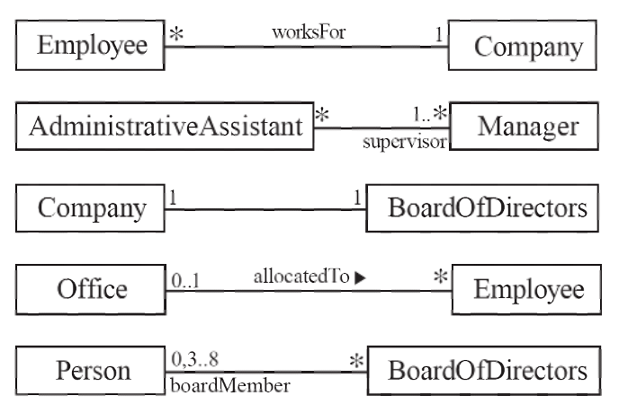
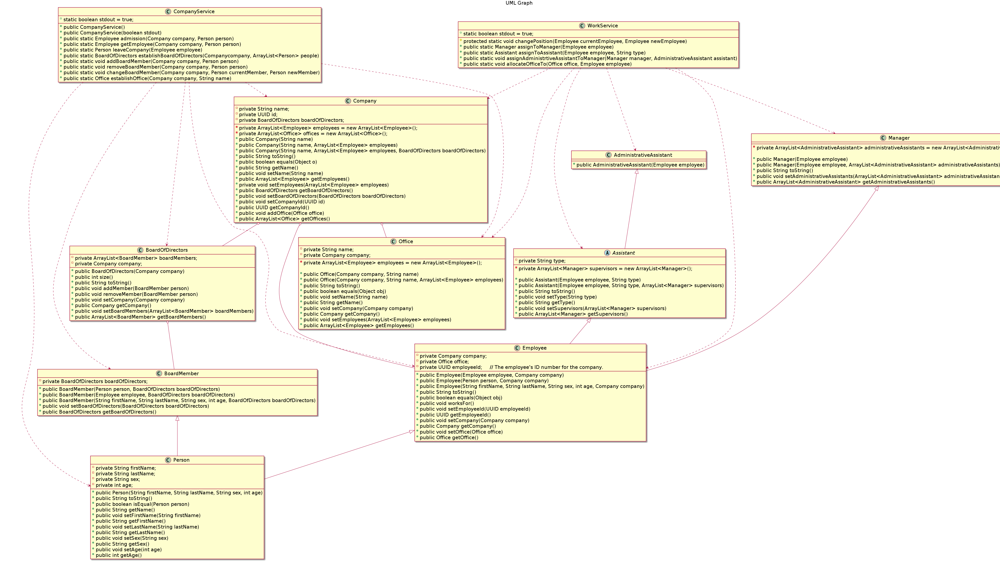

# OOPSE-Homework-4

- name: 李易庭
- dept.: 資工碩一
- stu. id: P7610 4419

---


[toc]

## Concept
There are two modules: `models` and `services`

### models module
This module defines classes **schemas** and there **basic operations**, each classes would not do operate to other object, all operation of relationship are defined in `services` module

There are 9 models in this modules, they are:

```
models
|- Person
|  |- BoardMember
|  |- Employee
|     |- Manager
|     |- Assistant (abstract)
|        |- AdminstrativeAssistant
|
|- Company
|- Office
|- BoardOfDirectors
```

### services module
This module defines relationships of each objects, therefore we don't use models object directly when doing the operations with relationships.

There are 2 services in this module, they are:
```
services
|- CompanyService
|- WorkService
```
---

### UML
<br>
<br>
<br>



<!-- ```plantuml
@startuml
Title "UML Graph"
skinparam defaultFontSize 20
skinparam classFontSize 20

class Person {
    - private String firstName;
    - private String lastName;
    - private String sex;
    - private int age;

    + public Person(String firstName, String lastName, String sex, int age)
    + public String toString()
    + public boolean isEqual(Person person)
    + public String getName()
    + public void setFirstName(String firstName)
    + public String getFirstName()
    + public void setLastName(String lastName)
    + public String getLastName()
    + public void setSex(String sex)
    + public String getSex()
    + public void setAge(int age)
    + public int getAge()
}
class BoardMember {
    - private BoardOfDirectors boardOfDirectors;

    + public BoardMember(Person person, BoardOfDirectors boardOfDirectors)
    + public BoardMember(Employee employee, BoardOfDirectors boardOfDirectors)
    + public BoardMember(String firstName, String lastName, String sex, int age, BoardOfDirectors boardOfDirectors)
    + public void setBoardOfDirectors(BoardOfDirectors boardOfDirectors)
    + public BoardOfDirectors getBoardOfDirectors()
}
BoardMember <|-- Person

class Employee {
    - private Company company;    
    - private Office office;
    - private UUID employeeId;     // The employee's ID number for the company.

    + public Employee(Employee employee, Company company)
    + public Employee(Person person, Company company)
    + public Employee(String firstName, String lastName, String sex, int age, Company company)
    + public String toString()
    + public boolean equals(Object obj)
    + public void worksFor()
    + public void setEmployeeId(UUID employeeId)
    + public UUID getEmployeeId()
    + public void setCompany(Company company)
    + public Company getCompany()
    + public void setOffice(Office office)
    + public Office getOffice()
}
Employee <|-- Person

class Manager{
    - private ArrayList<AdministrativeAssistant> administrativeAssistants = new ArrayList<AdministrativeAssistant>();

    + public Manager(Employee employee)
    + public Manager(Employee employee, ArrayList<AdministrativeAssistant> administrativeAssistants)
    + public String toString()
    + public void setAdministrativeAssistants(ArrayList<AdministrativeAssistant> administrativeAssistants)
    + public ArrayList<AdministrativeAssistant> getAdministrativeAssistants()
}
Manager <|-- Employee
abstract class Assistant {
    - private String type;
    - private ArrayList<Manager> supervisors = new ArrayList<Manager>();

    + public Assistant(Employee employee, String type)
    + public Assistant(Employee employee, String type, ArrayList<Manager> supervisors)
    + public String toString()
    + public void setType(String type)
    + public String getType()
    + public void setSupervisors(ArrayList<Manager> supervisors)
    + public ArrayList<Manager> getSupervisors()
}
Assistant <|-- Employee

class AdministrativeAssistant {
    + public AdministrativeAssistant(Employee employee)
}
AdministrativeAssistant <|-- Assistant

class Company {
    - private String name;
    - private UUID id;
    - private ArrayList<Employee> employees = new ArrayList<Employee>();
    - private ArrayList<Office> offices = new ArrayList<Office>();
    - private BoardOfDirectors boardOfDirectors; 

    + public Company(String name)
    + public Company(String name, ArrayList<Employee> employees) 
    + public Company(String name, ArrayList<Employee> employees, BoardOfDirectors boardOfDirectors)
    + public String toString()
    + public boolean equals(Object o)
    + public String getName()
    + public void setName(String name)
    + public ArrayList<Employee> getEmployees()
    + private void setEmployees(ArrayList<Employee> employees)
    + public BoardOfDirectors getBoardOfDirectors()
    + public void setBoardOfDirectors(BoardOfDirectors boardOfDirectors)
    + public void setCompanyId(UUID id)
    + public UUID getCompanyId()
    + public void addOffice(Office office)
    + public ArrayList<Office> getOffices()
}
Company o-- Employee
Company o-- Office
Company o-- BoardOfDirectors

class Office {
    - private String name;
    - private Company company;
    - private ArrayList<Employee> employees = new ArrayList<Employee>();

    + public Office(Company company, String name)
    + public Office(Company company, String name, ArrayList<Employee> employees)
    + public String toString()
    + public boolean equals(Object obj)
    + public void setName(String name)
    + public String getName()
    + public void setCompany(Company company)
    + public Company getCompany()
    + public void setEmployees(ArrayList<Employee> employees)
    + public ArrayList<Employee> getEmployees()
}

class BoardOfDirectors {
    - private ArrayList<BoardMember> boardMembers;
    - private Company company;

    + public BoardOfDirectors(Company company)
    + public int size()
    + public String toString()
    + public void addMember(BoardMember person)
    + public void removeMember(BoardMember person)
    + public void setCompany(Company company)
    + public Company getCompany()
    + public void setBoardMembers(ArrayList<BoardMember> boardMembers)
    + public ArrayList<BoardMember> getBoardMembers()
}
BoardOfDirectors o-- BoardMember

class CompanyService {
    + static boolean stdout = true;

    + public CompanyService()
    + public CompanyService(boolean stdout)
    + public static Employee admission(Company company, Person person)
    + public static Employee getEmployee(Company company, Person person)
    + public static Person leaveCompany(Employee employee)
    + public static BoardOfDirectors establishBoardOfDirectors(Companycompany, ArrayList<Person> people)
    + public static void addBoardMember(Company company, Person person)
    + public static void removeBoardMember(Company company, Person person)
    + public static void changeBoardMember(Company company, Person currentMember, Person newMember)
    + public static Office establishOffice(Company company, String name)
}
CompanyService ..> Company
CompanyService ..> BoardMember
CompanyService ..> BoardOfDirectors
CompanyService ..> Employee
CompanyService ..> Office
CompanyService ..> Person

class WorkService {
    + static boolean stdout = true; 

    # protected static void changePosition(Employee currentEmployee, Employee newEmployee)
    + public static Manager assignToManager(Employee employee)
    + public static Assistant assignToAssistant(Employee employee, String type)
    + public static void assignAdministrtiveAssistantToManager(Manager manager, AdministrativeAssistant assistant)
    + public static void allocateOfficeTo(Office office, Employee employee)
}
WorkService ..> AdministrativeAssistant
WorkService ..> Assistant
WorkService ..> Company
WorkService ..> Employee
WorkService ..> Manager
WorkService ..> Office
@enduml
``` -->

---

### Demo
```java
import java.util.ArrayList;
import models.AdministrativeAssistant;
import models.AdministrativeAssistant;
import models.Company;
import models.Employee;
import models.Manager;
import models.Office;
import models.Person;
import services.CompanyService;
import services.WorkService;

class main {

    public static void main(String[] args) {
        Person person1 = new Person("Tom"       , "Lee"     , "male", 23);
        Person person2 = new Person("Aiden"     , "Yeh"     , "male", 25);
        Person person3 = new Person("Will"      , "Lin"     , "male", 23);

        Company company1 = new Company("Google");

        // Company1 admit person1.
        Employee employee1 = CompanyService.admission(company1, person1);
        /** STDOUT
        * ========== Before admission ==========
        * <models.Company: Google>  has 0 employees 
        * ========== After admission ==========
        * <models.Employee: Tom Lee> works for Google
        * <models.Company: Google>  has 1 employees 
        * ========== End admission ==========
        */

        // Company1 admit person2.
        Employee employee2 = CompanyService.admission(company1, person2);
        /** STDOUT
         * ========== Before admission ==========
         * <models.Company: Google>  has 1 employees 
         * ========== After admission ==========
         * <models.Employee: Aiden Yeh> works for Google
         * <models.Company: Google>  has 2 employees 
         * ========== End admission ==========
        */

        // Get person1 from company1 in Employee object.
        employee1 = CompanyService.getEmployee(company1, person1);
        /** STDOUT
         * ========== Before getEmployee ==========
         * Found employee: <models.Employee: Tom Lee> works for Google
         * ========== After getEmployee ==========
        */

        // Company1 establish a new office named office1_1
        Office office1_1 = CompanyService.establishOffice(company1, "office1_1");
        /** STDOUT
         * ========== Before establishOffice ==========
         * <models.Company: Google>  has 2 employees 
         * ========== After establishOffice ==========
         * <models.Company: Google>  has 2 employees  and 1 offices
         * <models.Office: office1_1> 
         * ========== End establishOffice ==========
        */

        // Company1 establish a new office named office1_2
        Office office1_2 = CompanyService.establishOffice(company1, "office1_2");
        /** STDOUT
         * ========== Before establishOffice ==========
         * <models.Company: Google>  has 2 employees  and 1 offices
         * ========== After establishOffice ==========
         * <models.Company: Google>  has 2 employees  and 2 offices
         * <models.Office: office1_2> 
         * ========== End establishOffice ==========
        */

        // Allocate person1 to office1_1
        WorkService.allocateOfficeTo(office1_1, employee1);
        /** STDOUT
         * ========== Before allocateOfficeTo ==========
         * <models.Office: office1_1> 
         * <models.Employee: Tom Lee> works for Google
         * ========== After allocateOfficeTo ==========
         * <models.Office: office1_1>  with 1 employees
         * <models.Employee: Tom Lee> works for Google and at office office1_1
         * ========== End allocateOfficeTo ==========
        */

        WorkService.allocateOfficeTo(office1_2, employee2);
        /** STDOUT
         * ========== Before allocateOfficeTo ==========
         * <models.Office: office1_2> 
         * <models.Employee: Aiden Yeh> works for Google
         * ========== After allocateOfficeTo ==========
         * <models.Office: office1_2>  with 1 employees
         * <models.Employee: Aiden Yeh> works for Google and at office office1_2
         * ========== End allocateOfficeTo ==========
        */

        // Employee1 promote to manager.
        Manager manager1 = WorkService.assignToManager(employee1);
        /** STDOUT
         * ========== Before assignToManager ==========
         * <models.Employee: Tom Lee> works for Google and at office office1_1
         * 
         * ========== Before changePosition ==========
         * Current Position: <models.Employee: Tom Lee> works for Google and at office office1_1
         * ========== After changePosition ==========
         * New Position: <models.Manager: Tom Lee>  has 0 administrative assistants
         * ========== End changePosition ==========
         * 
         * ========== After assignToManager ==========
         * <models.Manager: Tom Lee>  has 0 administrative assistants
         * ========== End assignToManager ==========
        */

        // Employee1 promote to administrative assistant.
        AdministrativeAssistant admin_assistant1 = (AdministrativeAssistant)WorkService.assignToAssistant(employee2, "administrative");
        /** STDOUT
         * ========== Before assignToAssistant ==========
         * <models.Employee: Aiden Yeh> works for Google and at office office1_2

         * ========== Before changePosition ==========
         * Current Position: <models.Employee: Aiden Yeh> works for Google and at office office1_2
         * ========== After changePosition ==========
         * New Position: <models.AdministrativeAssistant: Aiden Yeh>  is a administrative assistant and supervisors are []
         * ========== End changePosition ==========

         * ========== After assignToAssistant ==========
         * <models.AdministrativeAssistant: Aiden Yeh>  is a administrative assistant and supervisors are []
         * ========== End assignToAssistant ==========
        */

        // Assign administrative assistant admin_assistant1 to manager manager1.
        WorkService.assignAdministrtiveAssistantToManager(manager1, admin_assistant1);
        /** STDOUT
         * ========== Before assignAdministrtiveAssistantToManager ==========
         * <models.Manager: Tom Lee>  has 0 administrative assistants
         * <models.AdministrativeAssistant: Aiden Yeh>  is a administrative assistant and supervisors are []
         * ========== After assignAdministrtiveAssistantToManager ==========
         * <models.Manager: Tom Lee>  has 1 administrative assistants
         * <models.AdministrativeAssistant: Aiden Yeh>  is a administrative assistant and supervisors are [<models.Manager: Tom Lee>  has 1 administrative assistants]
         * ========== End assignAdministrtiveAssistantToManager ==========
        */


        // Person1 leave company1.
        person1 = CompanyService.leaveCompany(employee1);
        /** STDOUT
         * ========== Before leaveCompany ==========
         * <models.Employee: Tom Lee> works for Google and at office office1_1
         * ========== After leaveCompany ==========
         * <models.Person: Tom Lee>
         * <models.Company: Google>  has 1 employees  and 2 offices
         * ========== End leaveCompany ==========
        */


        Person personA = new Person("Sundar"    , "Pichai"  , "male", 49);
        Person personB = new Person("Larry"     , "Page"    , "male", 49);
        Person personC = new Person("Sergey"    , "Brin"    , "male", 48);
        Person personD = new Person("Frances"   , "Arnold"  , "male", 65);
        Person personE = new Person("Eric"      , "Schmidt" , "male", 67);

        // Company1 establish a new board of directors with members personA, personB, personC.
        CompanyService.establishBoardOfDirectors(company1, new ArrayList<Person>(){{
            add(personA);
            add(personB);
            add(personC);
        }});
        /** STDOUT
         * ========== Before establishBoardOfDirectors ==========
         * <models.Company: Google>  has 1 employees  and 2 offices
         * ========== After establishBoardOfDirectors ==========
         * <models.Company: Google>  has 1 employees and 3 board of directors and 2 offices
         * ========== End establishBoardOfDirectors ==========
         */

        // Change company1's board member personC to personD.
        CompanyService.changeBoardMember(company1, personC, personD);
        /** STDOUT
         * ========== Before changeBoardMembers ==========
         * <models.Company: Google>  has 1 employees and 3 board of directors and 2 offices
         * ========== After changeBoardMember ==========
         * <models.BoardOfDirectors: Google>  has 3 board members
         * ========== End changeBoardMember ==========
         */

        // Add personE to company1's board of directors.
        CompanyService.addBoardMember(company1, personE);
        /** STDOUT
         * ========== Before addBoardMembers ==========
         * <models.Company: Google>  has 1 employees and 3 board of directors and 2 offices
         * ========== After addBoardMembers ==========
         * <models.Company: Google>  has 1 employees and 4 board of directors and 2 offices
         * ========== End addBoardMembers ==========
         */

        // Remove personE from company1's board of directors.
        CompanyService.removeBoardMember(company1, personE);
        /**
         * ========== Before removeBoardMembers ==========
         * <models.Company: Google>  has 1 employees and 4 board of directors and 2 offices
         * ========== After removeBoardMembers ==========
         * <models.BoardOfDirectors: Google>  has 3 board members
         * ========== End removeBoardMembers ==========
         */
    }
}
```

---

### Details of models module

#### Person Model
```java
package models;

/**
 * The Person object.
 * 
 * Stores the person's basic information, and be inherited by the Employee and BoardMember classes.
 */
public class Person {
    private String firstName;
    private String lastName;
    private String sex;
    private int age;

    public Person(String firstName, String lastName, String sex, int age) {
        this.setFirstName(firstName);
        this.setLastName(lastName);
        this.setSex(sex);
        this.setAge(age);
    }

    @Override
    public String toString() {
        return "<" + this.getClass().getName() + ": " + this.getFirstName() + " " + this.getLastName() + ">";
    }

    public boolean isEqual(Person person) {
        return this.getFirstName().equals(person.getFirstName()) && this.getLastName().equals(person.getLastName()) && this.getSex().equals(person.getSex()) && this.getAge() == person.getAge();
    }

    public String getName() {
        return this.getFirstName() + " " + this.getLastName();
    }
    
    public void setFirstName(String firstName) {
        this.firstName = firstName;
    }
    public String getFirstName() {
        return this.firstName;
    }

    public void setLastName(String lastName) {
        this.lastName = lastName;
    }
    public String getLastName() {
        return this.lastName;
    }

    public void setSex(String sex) {
        this.sex = sex;
    }
    public String getSex() {
        return this.sex;
    }

    public void setAge(int age) {
        this.age = age;
    }
    public int getAge() {
        return this.age;
    }
}
```

#### BoardMember Model
```java
package models;
import models.Employee;
import models.Person;

public class BoardMember extends Person {
    private BoardOfDirectors boardOfDirectors;

    public BoardMember(Person person, BoardOfDirectors boardOfDirectors) {
        super(person.getFirstName(), person.getLastName(), person.getSex(), person.getAge());
        this.setBoardOfDirectors(boardOfDirectors);
    }
    public BoardMember(Employee employee, BoardOfDirectors boardOfDirectors) {
        super(employee.getFirstName(), employee.getLastName(), employee.getSex(), employee.getAge());
        this.setBoardOfDirectors(boardOfDirectors);
    }
    public BoardMember(String firstName, String lastName, String sex, int age, BoardOfDirectors boardOfDirectors) {
        super(firstName, lastName, sex, age);
        this.setBoardOfDirectors(boardOfDirectors);
    }

    public void setBoardOfDirectors(BoardOfDirectors boardOfDirectors) {
        this.boardOfDirectors = boardOfDirectors;
    }
    public BoardOfDirectors getBoardOfDirectors() {
        return this.boardOfDirectors;
    }
}
```

#### Employee Model
```java
package models;
import java.util.UUID;

/**
 * The Employee object.
 * 
 * Could be instantiated by the {@link hw4.services.CompanyService#admission(Company, Person)} method.
 * Could be inherited by the Manager and Assistant classes.
 */
public class Employee extends Person {
    private Company company;    
    private Office office;
    private UUID employeeId;     // The employee's ID number for the company.

    public Employee(Employee employee, Company company) {
        super(employee.getFirstName(), employee.getLastName(), employee.getSex(), employee.getAge());
        this.setEmployeeId(employee.getEmployeeId());
        this.setCompany(company);
    }

    public Employee(Person person, Company company) {
        super(person.getFirstName(), person.getLastName(), person.getSex(), person.getAge());
        this.setEmployeeId(UUID.randomUUID());
        this.setCompany(company);
    }

    public Employee(String firstName, String lastName, String sex, int age, Company company) {
        super(firstName, lastName, sex, age);
        this.setEmployeeId(UUID.randomUUID());
        this.setCompany(company);
    }

    @Override
    public String toString() {
        String appendix = (this.getOffice() != null) ? " and at office " + this.getOffice().getName() : "";
        return super.toString() + " works for " + this.getCompany().getName() + appendix;
    }

    @Override
    public boolean equals(Object obj) {
        if (obj instanceof Employee) {
            return this.getEmployeeId().equals(((Employee) obj).getEmployeeId());
        }
        return false;
    }

    public void worksFor() {
        System.out.printf("%s %s works for %s\n", this.getFirstName(), this.getLastName(), this.getCompany().getName());
    }

    public void setEmployeeId(UUID employeeId) {
        this.employeeId = employeeId;
    }
    public UUID getEmployeeId() {
        return this.employeeId;
    }

    public void setCompany(Company company) {
        this.company = company;
    }
    public Company getCompany() {
        return this.company;
    }

    public void setOffice(Office office) {
        this.office = office;
    }
    public Office getOffice() {
        return this.office;
    }
}
```

#### Manager Model
```java
package models;
import java.util.ArrayList;
import models.AdministrativeAssistant;
import models.Employee;

public class Manager extends Employee {
    private ArrayList<AdministrativeAssistant> administrativeAssistants = new ArrayList<AdministrativeAssistant>();


    public Manager(Employee employee) {
        super(employee, employee.getCompany());
    }

    public Manager(Employee employee, ArrayList<AdministrativeAssistant> administrativeAssistants) {
        this(employee);
        this.setAdministrativeAssistants(administrativeAssistants);
    }

    @Override
    public String toString() {
        return "<" + this.getClass().getName() + ": " + this.getName() + "> " + " has " + this.getAdministrativeAssistants().size() + " administrative assistants";
    }

    public void setAdministrativeAssistants(ArrayList<AdministrativeAssistant> administrativeAssistants) {
        this.administrativeAssistants = administrativeAssistants;
    }
    public ArrayList<AdministrativeAssistant> getAdministrativeAssistants() {
        return this.administrativeAssistants;
    }
}
```

#### Assistant Model
```java
package models;
import java.util.ArrayList;
import models.Employee;

/**
 * The Assistant abstract class.
 * 
 * Only the AdministrativeAssistant classes are instantiable.
 */
public abstract class Assistant extends Employee {
    private String type;
    private ArrayList<Manager> supervisors = new ArrayList<Manager>();

    public Assistant(Employee employee, String type) {
        super(employee, employee.getCompany());
        this.setType(type);
    }

    public Assistant(Employee employee, String type, ArrayList<Manager> supervisors) {
        super(employee, employee.getCompany());
        this.setType(type);
        this.setSupervisors(supervisors);
    }

    @Override
    public String toString() {
        return "<" + this.getClass().getName() + ": " + this.getName() + "> " + " is a " + this.getType() +" assistant and supervisors are " + this.getSupervisors().toString();
    }

    public void setType(String type) {
        this.type = type;
    }
    public String getType() {
        return this.type;
    }

    public void setSupervisors(ArrayList<Manager> supervisors) {
        this.supervisors = supervisors;
    }
    public ArrayList<Manager> getSupervisors() {
        return this.supervisors;
    }
}
```

#### AdministrativeAssistant Model
```java
package models;
import models.Assistant;

public class AdministrativeAssistant extends Assistant {
    public AdministrativeAssistant(Employee employee) {
        super(employee, "administrative");
    }
}
```

#### Company Model
```java
package models;
import java.util.ArrayList;
import java.util.UUID;

public class Company {
    private String name;
    private UUID id;
    private ArrayList<Employee> employees = new ArrayList<Employee>();
    private ArrayList<Office> offices = new ArrayList<Office>();
    private BoardOfDirectors boardOfDirectors; 

    public Company(String name) {
        this.setName(name);
        this.setCompanyId(UUID.randomUUID());
    }
    public Company(String name, ArrayList<Employee> employees) {
        this(name);
        this.setEmployees(employees);
    }
    public Company(String name, ArrayList<Employee> employees, BoardOfDirectors boardOfDirectors) {
        this(name, employees);
        this.setBoardOfDirectors(boardOfDirectors);
    }

    @Override
    public String toString() {
        String appendix = this.getBoardOfDirectors() != null ? "and " + this.boardOfDirectors.size() + " board of directors" : "";
        appendix += this.getOffices().size() > 0 ? " and " + this.getOffices().size() + " offices" : "";
        return "<" + this.getClass().getName() + ": " + this.name + "> " + " has " + this.employees.size() + " employees " + appendix;
    }

    @Override
    public boolean equals(Object o) {
        if (o instanceof Company) {
            Company other = (Company) o;
            return this.getCompanyId().equals(other.getCompanyId());
        }
        return false;
    }

    public String getName() {
        return name;
    }
    public void setName(String name) {
        this.name = name;
    }

    public ArrayList<Employee> getEmployees() {
        return employees;
    }
    private void setEmployees(ArrayList<Employee> employees) {
        this.employees = employees;
    }

    public BoardOfDirectors getBoardOfDirectors() {
        return boardOfDirectors;
    }
    public void setBoardOfDirectors(BoardOfDirectors boardOfDirectors) {
        this.boardOfDirectors = boardOfDirectors;
    }

    public void setCompanyId(UUID id) {
        this.id = id;
    }
    public UUID getCompanyId() {
        return this.id;
    }

    public void addOffice(Office office) {
        this.offices.add(office);
    }
    public ArrayList<Office> getOffices() {
        return this.offices;
    }

}
```

#### Office Model
```java
package models;
import java.util.ArrayList;

public class Office {
    private String name;
    private Company company;
    private ArrayList<Employee> employees = new ArrayList<Employee>();

    public Office(Company company, String name) {
        this.setName(name);
        this.setCompany(company);
    }
    public Office(Company company, String name, ArrayList<Employee> employees) {
        this(company, name);
        this.setEmployees(employees);
    }

    @Override
    public String toString() {
        String appendix = (this.getEmployees() != null && this.getEmployees().size() > 0) ? " with " + this.getEmployees().size() + " employees" : "";
        return "<" + this.getClass().getName() + ": " + this.name + "> " + appendix;
    }
    @Override
    public boolean equals(Object obj) {
        if (obj instanceof Office) {
            return this.getName().equals(((Office) obj).getName());
        }
        return false;
    }

    public void setName(String name) {
        this.name = name;
    }
    public String getName() {
        return this.name;
    }

    public void setCompany(Company company) {
        this.company = company;
    }
    public Company getCompany() {
        return this.company;
    }

    public void setEmployees(ArrayList<Employee> employees) {
        this.employees = employees;
    }
    public ArrayList<Employee> getEmployees() {
        return this.employees;
    }
}
```

#### BoardOfDirectors Model
```java
package models;
import java.util.ArrayList;

public class BoardOfDirectors {
    private ArrayList<BoardMember> boardMembers;
    private Company company;

    public BoardOfDirectors(Company company) {
        this.setCompany(company);
    }

    public int size() {
        return this.boardMembers.size();
    }

    @Override
    public String toString() {
        return "<" + this.getClass().getName() + ": " + this.company.getName() + "> " + " has " + this.boardMembers.size() + " board members";
    }

    public void addMember(BoardMember person) {
        this.boardMembers.add(person);
    }
    public void removeMember(BoardMember person) {
        this.boardMembers.remove(person);
    }

    public void setCompany(Company company) {
        this.company = company;
    }
    public Company getCompany() {
        return this.company;
    }

    public void setBoardMembers(ArrayList<BoardMember> boardMembers) {
        this.boardMembers = boardMembers;
    }
    public ArrayList<BoardMember> getBoardMembers() {
        return this.boardMembers;
    }
}
```

---

### Details of services module

#### CompanyService Service
```java
package services;

import java.util.ArrayList;
import models.BoardMember;
import models.BoardOfDirectors;
import models.Company;
import models.Employee;
import models.Office;
import models.Person;

public class CompanyService {
    static boolean stdout = true;

    public CompanyService() {
        // Use default setup.
    }
    public CompanyService(boolean stdout) {
        CompanyService.stdout = stdout;
    }

   /**
     * Admit a new employee who with person object infromation to a company.
     * 
     * @param company
     * @param person
     */
    public static Employee admission(Company company, Person person) {
        if (stdout) {
            System.out.println("\n========== Before admission ==========");
            System.out.println(company.toString());
        }

        Employee newEmplyee = new Employee(person, company);
        company.getEmployees().add(newEmplyee);

        if (stdout) {
            System.out.println("========== After admission ==========");
            System.out.println(newEmplyee.toString());
            System.out.println(company.toString());
            System.out.println("========== End admission ==========\n");
        }
        return newEmplyee;
    }

    /**
     * Get employee from a company by Person object.
     * 
     * @param company
     * @param person
     * 
     * @return Employee object
     */
    public static Employee getEmployee(Company company, Person person) {
        for (Employee employee : company.getEmployees()) {
            if (employee.isEqual(person)) {
                if (stdout) {
                    System.out.println("\n========== Before getEmployee ==========");
                    System.out.println("Found employee: " + employee.toString());
                    System.out.println("========== After getEmployee ==========\n");
                }
                return employee;
            }
        }
        if (stdout) {
            System.out.println("No such employee.");
            System.out.println("========== After getEmployee ==========\n");
        }
        return null;
    }

    /**
     * Employee leaves the company.
     * 
     * @param employee
     */
    public static Person leaveCompany(Employee employee) {
        if (stdout) {
            System.out.println("\n========== Before leaveCompany ==========");
            System.out.println(employee.toString());
        }
        Company company = employee.getCompany();

        // Remove employee from company.
        company.getEmployees().remove(employee);

        // Remove company from employee.
        employee.setCompany(null);

        // Transform to person object.
        Person person = new Person(employee.getFirstName(), employee.getLastName(), employee.getSex(), employee.getAge());

        if (stdout) {
            System.out.println("========== After leaveCompany ==========");
            System.out.println(person.toString());
            System.out.println(company.toString());
            System.out.println("========== End leaveCompany ==========\n");
        }
        return person;
    }


    /**
     * Establish a new board member for a company.
     * 
     * @param company
     * @param boardMembers The board members to be added.
     */
    public static BoardOfDirectors establishBoardOfDirectors(Company company, ArrayList<Person> people) {
        if (stdout) {
            System.out.println("\n========== Before establishBoardOfDirectors ==========");
            System.out.println(company.toString());
        }

        // Check if the company already has a board of directors.
        if (company.getBoardOfDirectors() != null) {
            System.out.println("The company already has a board of directors.");
            return null;
        }

        // Check the new board of directors has enough members.
        if (people.size() < 3) {
            System.out.println("The new board of directors has not enough members.");
            return null;
        }

        // Check the new board of directors don't has too many members.
        if (people.size() > 8) {
            System.out.println("The new board of directors has too many members.");
            return null;
        }

        // Create a new board of directors.
        BoardOfDirectors newBoardOfDirectors = new BoardOfDirectors(company);

        // Add new board of directors to company.
        company.setBoardOfDirectors(newBoardOfDirectors);

        // Instantiate all new board members.
        ArrayList<BoardMember> boardMembers = new ArrayList<BoardMember>();
        for (Person person : people) {
            BoardMember boardMember = new BoardMember(person, newBoardOfDirectors);
            boardMembers.add(boardMember);
        }

        // Asign the new board members to the new board of directors.
        newBoardOfDirectors.setBoardMembers(boardMembers);

        if (stdout) {
            System.out.println("========== After establishBoardOfDirectors ==========");
            System.out.println(company.toString());
            System.out.println("========== End establishBoardOfDirectors ==========\n");
        }

        return newBoardOfDirectors;
    }

    /**
     * Add new board member to a company.
     * 
     * @param company
     * @param person
     */
    public static void addBoardMember(Company company, Person person) {
        if (stdout) {
            System.out.println("\n========== Before addBoardMembers ==========");
            System.out.println(company.toString());
        }

        // Check if the company has the board of directors yet.
        if (company.getBoardOfDirectors() == null) {
            System.out.println(company.getName() + "has no board of directors yet.");
            return;
        }

        // Check the new board of directors don't has too many members.
        if (company.getBoardOfDirectors().size() > 7) {
            System.out.println("The new board of directors has too many members.");
            return;
        }

        // Instantiate a new board member.
        BoardMember newBoardMember = new BoardMember(person, company.getBoardOfDirectors());

        // Add the new board member to the board of directors.
        company.getBoardOfDirectors().getBoardMembers().add(newBoardMember);

        if (stdout) {
            System.out.println("========== After addBoardMembers ==========");
            System.out.println(company.toString());
            System.out.println("========== End addBoardMembers ==========\n");
        }
    }

    /**
     * Remove board member from a company.
     * 
     * @param company
     * @param person
     */
    public static void removeBoardMember(Company company, Person person) {
        if (stdout) {
            System.out.println("\n========== Before removeBoardMembers ==========");
            System.out.println(company.toString());
        }

        // Check if the company has the board of directors yet.
        if (company.getBoardOfDirectors() == null) {
            System.out.println(company.getName() + "has no board of directors yet.");
            return;
        }

        // Check if the company has the enough board members.
        if (company.getBoardOfDirectors().size() < 4) {
            System.out.println(company.getName() + "hasn't enougth board member.");
            return;
        }

        BoardOfDirectors boardOfDirectors = company.getBoardOfDirectors();

        // Remove the board member.
        for (BoardMember boardMember : boardOfDirectors.getBoardMembers()) {
            // Get the target board member.
            if ((person).isEqual((Person) boardMember)) {
                // Remove target.
                boardOfDirectors.getBoardMembers().remove(boardMember);
                break;
            }
        }

        if (stdout) {
            System.out.println("========== After removeBoardMembers ==========");
            System.out.println(boardOfDirectors.toString());
            System.out.println("========== End removeBoardMembers ==========\n");
        }
    }

    /**
     * Remove board member from a company.
     * 
     * @param company
     * @param person
     */
    public static void changeBoardMember(Company company, Person currentMember, Person newMember) {
        if (stdout) {
            System.out.println("\n========== Before changeBoardMembers ==========");
            System.out.println(company.toString());
        }

        // Check if the company has the board of directors yet.
        if (company.getBoardOfDirectors() == null) {
            System.out.println(company.getName() + "has no board of directors yet.");
            return;
        }

        // Check the new board of directors don't has too many members.
        if (company.getBoardOfDirectors().size() > 7) {
            System.out.println("The new board of directors has too many members.");
            return;
        }

        BoardOfDirectors boardOfDirectors = company.getBoardOfDirectors();

        // Instantiate a new board member.
        BoardMember newboardMember = new BoardMember(newMember, company.getBoardOfDirectors());

        // Change the board member.
        for (BoardMember boardMember : company.getBoardOfDirectors().getBoardMembers()) {
            // Get the current board member.
            if (((Person)boardMember).isEqual(currentMember)) {
                // Remove old one.
                boardOfDirectors.getBoardMembers().remove(boardMember);
                // Add new one.
                boardOfDirectors.getBoardMembers().add(newboardMember);
                break;
            }
        }

        if (stdout) {
            System.out.println("========== After changeBoardMember ==========");
            System.out.println(boardOfDirectors.toString());
            System.out.println("========== End changeBoardMember ==========\n");
        }
    }

    /**
     * Establish a new office.
     * 
     * @param company
     * @param name
     */
    public static Office establishOffice(Company company, String name) {
        if (stdout) {
            System.out.println("\n========== Before establishOffice ==========");
            System.out.println(company.toString());
        }
        // Check if the company already has a same name office.
        for (Office office : company.getOffices()) {
            if (office.getName().equals(name)) {
                System.out.println("The company already has a same name office.");
                return null;
            }
        }

        // Instantiate a new office.
        Office office = new Office(company, name);

        // Asign the new office to the company.
        company.getOffices().add(office);

        if (stdout) {
            System.out.println("========== After establishOffice ==========");
            System.out.println(company.toString());
            System.out.println(office.toString());
            System.out.println("========== End establishOffice ==========\n");
        }

        return office;
    }
}
```

#### WorkService Service
```java
package services;
import models.AdministrativeAssistant;
import models.Assistant;
import models.Company;
import models.Employee;
import models.Manager;
import models.Office;


public class WorkService {
    static boolean stdout = true; 

    /**
     * Change employee.
     * 
     * @param currentEmployee
     * @param newPosition
     */
    protected static void changePosition(Employee currentEmployee, Employee newEmployee) {
        if (stdout) {
            System.out.println("\n========== Before changePosition ==========");
            System.out.println("Current Position: " + currentEmployee.toString());
        }


        // Check if these are in same company.
        if (!currentEmployee.getCompany().equals(newEmployee.getCompany())) {
            throw new IllegalArgumentException("Employees must be in the same company");
        }
        Company company = currentEmployee.getCompany();

        // Remove the employee from the company.
        company.getEmployees().remove(currentEmployee);

        // Add the manager into company.
        company.getEmployees().add(newEmployee);

        if (stdout) {
            System.out.println("========== After changePosition ==========");
            System.out.println("New Position: " + newEmployee.toString());
            System.out.println("========== End changePosition ==========\n");
        }
    }

    /**
     * assigns an employee to a manager.
     * 
     * @param employee The employee to be assigned.
     * 
     * @return The manager that the employee is assigned to.
     */
    public static Manager assignToManager(Employee employee) {
        if (stdout) {
            System.out.println("\n========== Before assignToManager ==========");
            System.out.println(employee.toString());
        }

        Manager manager = new Manager(employee);

        // Change position of the employee.
        changePosition(employee, manager);

        if (stdout) {
            System.out.println("========== After assignToManager ==========");
            System.out.println(manager.toString());
            System.out.println("========== End assignToManager ==========\n");
        }

        return manager;
    }

    /**
     * assigns an employee to a assitant.
     * 
     * @param employee The employee to be assigned.
     * @param type The type of the assistant.
     * 
     * @return The assistant that the employee is assigned to.
     */
    public static Assistant assignToAssistant(Employee employee, String type) {
        if (stdout) {
            System.out.println("\n========== Before assignToAssistant ==========");
            System.out.println(employee.toString());
        }

        // Check if the type is valid.
        if (type == "administrative") {
            // Instantiate the assistant.
            AdministrativeAssistant assistant = new AdministrativeAssistant(employee);

            // Change position of the employee.
            changePosition(employee, assistant);

            if (stdout) {
                System.out.println("========== After assignToAssistant ==========");
                System.out.println(assistant.toString());
                System.out.println("========== End assignToAssistant ==========\n");
            }
            return assistant;
        }
        //***********************************************
        // Can assign to other types of assistants here.
        //***********************************************


        throw new IllegalArgumentException("The type is not valid");
    }

    /**
     * Assigns an administrative assistant to a manager.
     * 
     * @param manager
     * @param assistant
     */
    public static void assignAdministrtiveAssistantToManager(Manager manager, AdministrativeAssistant assistant) {
        if (stdout) {
            System.out.println("\n========== Before assignAdministrtiveAssistantToManager ==========");
            System.out.println(manager.toString());
            System.out.println(assistant.toString());
        }
        // Check if the manager and the assistant are in the same company.
        if (!manager.getCompany().equals(assistant.getCompany())) {
            throw new IllegalArgumentException("The manager and the assistant must be in the same company");
        }

        // Check if the assistant is already assigned to the manager.
        for (AdministrativeAssistant admin_assistant : manager.getAdministrativeAssistants()) {
            if (admin_assistant.equals(assistant)) {
                throw new IllegalArgumentException("The assistant is already assigned to the manager");
            }
        }

        manager.getAdministrativeAssistants().add(assistant);
        assistant.getSupervisors().add(manager);

        if (stdout) {
            System.out.println("========== After assignAdministrtiveAssistantToManager ==========");
            System.out.println(manager.toString());
            System.out.println(assistant.toString());
            System.out.println("========== End assignAdministrtiveAssistantToManager ==========\n");
        }
    }

    /**
     * Allocate an office to employee.
     * 
     * @param office The office to be allocated.
     * @param employee The employee to be allocated.
     */
    public static void allocateOfficeTo(Office office, Employee employee) {
        if (stdout) {
            System.out.println("\n========== Before allocateOfficeTo ==========");
            System.out.println(office.toString());
            System.out.println(employee.toString());
        }

        // Check if these are in same company.
        if (!office.getCompany().equals(employee.getCompany())) {
            throw new IllegalArgumentException("Employee and office must be in the same company");
        }

        // Check if the employee is already in an office.
        if (employee.getOffice() != null && employee.getOffice().equals(office)) {
            System.out.println("Employee is already in an office");
        }

        // Add the employee to the office.
        office.getEmployees().add(employee);

        // Set the employee's office.
        employee.setOffice(office);
        if (stdout) {
            System.out.println("========== After allocateOfficeTo ==========");
            System.out.println(office.toString());
            System.out.println(employee.toString());
            System.out.println("========== End allocateOfficeTo ==========\n");
        }
    }
}
```
