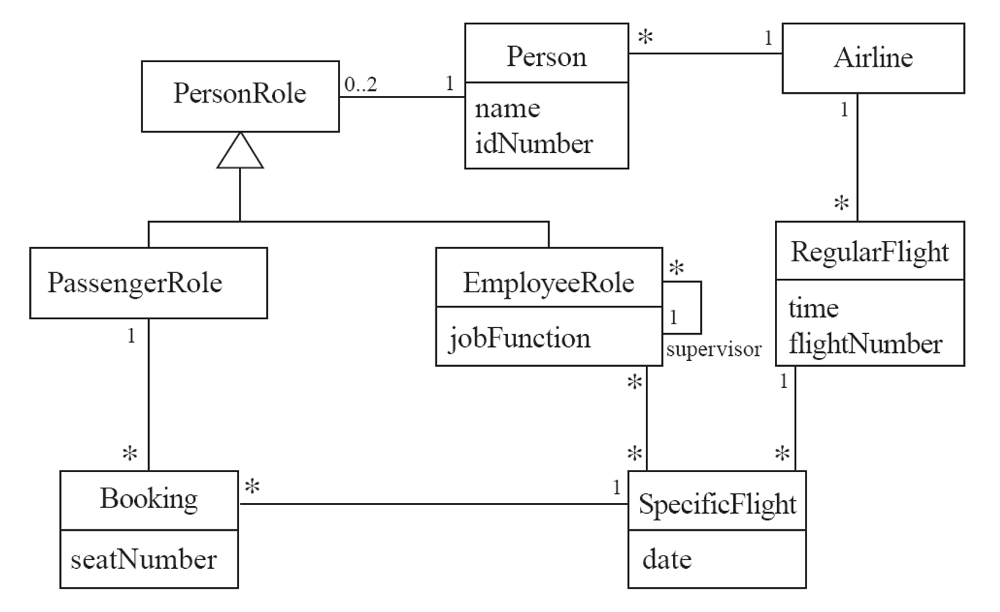

# OOPSE Homework 5

- name: 李易庭
- dept.: 資工碩一
- stu. id: P7610 4419
  
---


## Concept
  
There are two modules: `models` and `services`
  
### models module
  
This module defines classes **schemas** and **basic operations, each class would not do operate on other objects, and all operations of relationship are defined in `services` module
  
There are 8 models in this module, they are:
  
```sh
models
    ├── Airline.java
    ├── Booking.java
    ├── flight
    │   ├── RegularFlight.java
    │   └── SpecificFlight.java
    ├── Person.java
    └── role
        ├── EmployeeRole.java
        ├── PassengerRole.java
        └── PersonRole.java
```
  
### services module
  
This module defines the relationships of each object, therefore we don't use model objects directly when doing the operations with relationships.
  
There are 2 services in this module, they are:

```sh
services
  ├── FlightService.java
  └── RoleService.java
```

***

## Run the code by App.java
```java
import java.time.LocalDate;
import java.time.LocalDateTime;

import models.Airline;
import models.Booking;
import models.Person;
import models.flight.RegularFlight;
import models.flight.SpecificFlight;
import models.role.EmployeeRole;
import models.role.PassengerRole;
import services.FlightService;
import services.RoleService;

public class App {
    public static void main(String[] args) throws Exception {
        // Create 2 people with name "Alice" and "Bob".
        Person per1 = new Person("Alice");
        Person per2 = new Person("Bob");
        Person per3 = new Person("Charlie");

        // assign PasengerRole for p1 and p2.
        PassengerRole pas1 = RoleService.assignRole(per1, new PassengerRole());
        // STDOUT
        // ========== Before assignRole ==========
        // Person{id=1, name='Alice', roles=[]}
        // ========== After assignRole ==========
        // Person{id=1, name='Alice', roles=[PassengerRole{name=Alice, bookings=[]}]}
        // PassengerRole{name=Alice, bookings=[]}
        // ========== End assignRole ==========

        PassengerRole pas2 = RoleService.assignRole(per2, new PassengerRole());
        // STDOUT
        // ========== Before assignRole ==========
        // Person{id=2, name='Bob', roles=[]}
        // ========== After assignRole ==========
        // Person{id=2, name='Bob', roles=[PassengerRole{name=Bob, bookings=[]}]}
        // PassengerRole{name=Bob, bookings=[]}
        // ========== End assignRole =========

        // assign EployeeRole for p1 and p3.
        EmployeeRole emp1 = RoleService.assignRole(per1, new EmployeeRole());
        // STDOUT
        // ========== Before assignRole ==========
        // Person{id=1, name='Alice', roles=[PassengerRole{name=Alice, bookings=[]}]}
        // ========== After assignRole ==========
        // Person{id=1, name='Alice', roles=[PassengerRole{name=Alice, bookings=[]},
        // EmployeeRole{person name=Alice, supervisor=null, subordinates=[], date of
        // flights=[]}]}
        // EmployeeRole{person name=Alice, supervisor=null, subordinates=[], date of
        // flights=[]}
        // ========== End assignRole ==========

        EmployeeRole emp3 = RoleService.assignRole(per3, new EmployeeRole());
        // STDOUT
        // ========== Before assignRole ==========
        // Person{id=3, name='Charlie', roles=[]}
        // ========== After assignRole ==========
        // Person{id=3, name='Charlie', roles=[EmployeeRole{person name=Charlie,
        // supervisor=null, subordinates=[], date of flights=[]}]}
        // EmployeeRole{person name=Charlie, supervisor=null, subordinates=[], date of
        // flights=[]}
        // ========== End assignRole ==========

        // Print out the Person of p1 and p2.
        System.out.println(per1 + "\n" + per2 + "\n" + per3);
        // STDOUT
        // Person{id=1, name='Alice', roles=[PassengerRole{name=Alice, bookings=[]},
        // EmployeeRole{person name=Alice, supervisor=null, subordinates=[], date of
        // flights=[]}]}
        // Person{id=2, name='Bob', roles=[PassengerRole{name=Bob, bookings=[]}]}
        // Person{id=3, name='Charlie', roles=[EmployeeRole{person name=Charlie,
        // supervisor=null, subordinates=[], date of flights=[]}]}

        // Asiagn emp1 as a superviser to emp3.
        RoleService.assignSupervisor(emp3, emp1);
        // STDOUT
        // ========== Before assignSupervisor ==========
        // EmployeeRole{person name=Charlie, supervisor=null, subordinates=[], date of
        // flights=[]}
        // EmployeeRole{person name=Alice, supervisor=null, subordinates=[], date of
        // flights=[]}
        // ========== After assignSupervisor ==========
        // EmployeeRole{person name=Charlie, supervisor=Alice, subordinates=[], date of
        // flights=[]}
        // EmployeeRole{person name=Alice, supervisor=null, subordinates=[Charlie], date
        // of flights=[]}
        // ========== End assignSupervisor ==========

        // Remove emp1 as a superviser from emp3.
        RoleService.removeSubordinate(emp1, emp3);
        // STDOUT
        // ========== Before removeSubordinate ==========
        // EmployeeRole{person name=Alice, supervisor=null, subordinates=[Charlie], date
        // of flights=[]}
        // EmployeeRole{person name=Charlie, supervisor=Alice, subordinates=[], date of
        // flights=[]}
        // ========== After removeSubordinate ==========
        // EmployeeRole{person name=Alice, supervisor=null, subordinates=[], date of
        // flights=[]}
        // EmployeeRole{person name=Charlie, supervisor=null, subordinates=[], date of
        // flights=[]}
        // ========== End removeSubordinate ==========
        // Create an airline with id 1.

        Airline a1 = new Airline(1);

        // Add the people to the airline.
        FlightService.addPersonToAirline(a1, per1);
        // STDOUT
        // ========== Before addPersonToAirline ==========
        // Airline{id=1, people=[], regularFlights=[]}
        // Person{id=1, name='Alice', roles=[PassengerRole{name=Alice, bookings=[]},
        // EmployeeRole{person name=Alice, supervisor=null, subordinates=[], date of
        // flights=[]}]}
        // ========== After addPersonToAirline ==========
        // Airline{id=1, people=[Alice], regularFlights=[]}
        // Person{id=1, name='Alice', roles=[PassengerRole{name=Alice, bookings=[]},
        // EmployeeRole{person name=Alice, supervisor=null, subordinates=[], date of
        // flights=[]}], airline id=1}
        // ========== End addPersonToAirline ==========

        FlightService.addPersonToAirline(a1, per2);
        // STDOUT
        // ========== Before addPersonToAirline ==========
        // Airline{id=1, people=[Alice], regularFlights=[]}
        // Person{id=2, name='Bob', roles=[PassengerRole{name=Bob, bookings=[]}]}
        // ========== After addPersonToAirline ==========
        // Airline{id=1, people=[Alice, Bob], regularFlights=[]}
        // Person{id=2, name='Bob', roles=[PassengerRole{name=Bob, bookings=[]}],
        // airline id=1}
        // ========== End addPersonToAirline ==========

        // Create 1 regular flights with flight number 1.
        RegularFlight rf1 = FlightService.createRegularFlightForAirline(LocalDateTime.now(), 1, a1);
        // STDOUT
        // ========== Before createRegularFlightForAirline ==========
        // Airline{id=1, people=[Alice, Bob], regularFlights=[]}
        // ========== After createRegularFlightForAirline ==========
        // Airline{id=1, people=[Alice, Bob], regularFlights=[1]}
        // ========== End createRegularFlightForAirline ==========
        // Create 1 special flight for regular flight.

        SpecificFlight sf1 = FlightService.createSpecificFlightForRegularFlight(LocalDate.now(), rf1);
        // STDOUT
        // ========== Before createSpecificFlightForRegularFlight ==========
        // RegularFlight{time=2022-06-01T10:42:57.053820870, flightNumber=1,
        // airline=Airline{id=1, people=[Alice, Bob], regularFlights=[1]},
        // specificFlights number=0}
        // ========== After createSpecificFlightForRegularFlight ==========
        // RegularFlight{time=2022-06-01T10:42:57.053820870, flightNumber=1,
        // airline=Airline{id=1, people=[Alice, Bob], regularFlights=[1]},
        // specificFlights number=1}
        // ========== End createSpecificFlightForRegularFlight ==========

        // Add the EmployeeRole `emp1` to the specifc flight `sf1`.
        RoleService.assignEmployeeToSpecifcFlight(emp1, sf1);
        // STDOUT
        // ========== Before assignEmployeeToSpecifcFlight ==========
        // EmployeeRole{person name=Alice, supervisor=null, subordinates=[], date of
        // flights=[]}
        // SpecificFlight{date=2022-06-01, regularFlight=1, bookings=[], employees=[]}
        // ========== After assignEmployeeToSpecifcFlight ==========
        // EmployeeRole{person name=Alice, supervisor=null, subordinates=[], date of
        // flights=[2022-06-01]}
        // SpecificFlight{date=2022-06-01, regularFlight=1, bookings=[],
        // employees=[Alice]}
        // ========== End assignEmployeeToSpecifcFlight ==========

        // PassengerRole `pas1` book a seat with number 1 of specifc flight `sf1`.
        Booking b1 = RoleService.bookASpecificFlight(pas1, 1, sf1);
        // STDOUT
        // ========== Before bookASpecificFlight ==========
        // PassengerRole{name=Alice, bookings=[]}
        // SpecificFlight{date=2022-06-01, regularFlight=1, bookings=[],
        // employees=[Alice]}
        // ========== After bookASpecificFlight ==========
        // PassengerRole{name=Alice, bookings=[1]}
        // SpecificFlight{date=2022-06-01, regularFlight=1, bookings=[1],
        // employees=[Alice]}
        // ========== End bookASpecificFlight ==========
    }
}
```

## models
### flight/RegularFlight.java
```java
package models.flight;

import java.time.LocalDateTime;
import java.util.ArrayList;

import models.Airline;

public class RegularFlight {
    private LocalDateTime time;
    private int flightNumber;
    private Airline airline;
    private ArrayList<SpecificFlight> specificFlights = new ArrayList<>();

    private static int flightNumberCounter;
    private static int nextFlightNumber() {
        return flightNumberCounter++;
    }

    public RegularFlight(LocalDateTime time, Airline airline) {
        this.setTime(time);
        this.setFlightNumber(nextFlightNumber());
        this.setAirline(airline);
    }

    public RegularFlight(LocalDateTime time, int flightNumber, Airline airline) {
        this.setTime(time);
        this.setFlightNumber(flightNumber);
        this.setAirline(airline);
    }

    public RegularFlight(LocalDateTime time, int flightNumber, Airline airline, ArrayList<SpecificFlight> specificFlights) {
        this(time, flightNumber, airline);
        this.setSpecificFlights(specificFlights);
    }

    @Override
    public String toString() {
        return "RegularFlight{" +
                "time=" + time +
                ", flightNumber=" + flightNumber +
                ", airline=" + airline +
                ", specificFlights number=" + specificFlights.size() +
                '}';
    }

    @Override
    public boolean equals(Object o) {
        if (this == o) return true;
        if (o == null || getClass() != o.getClass()) return false;

        RegularFlight that = (RegularFlight) o;

        if (!time.equals(that.time)) return false;
        return flightNumber == that.flightNumber;
    }

    public LocalDateTime getTime() {
        return time;
    }

    public void setTime(LocalDateTime time) {
        this.time = time;
    }

    public int getFlightNumber() {
        return flightNumber;
    }

    public void setFlightNumber(int flightNumber) {
        this.flightNumber = flightNumber;
    }

    public ArrayList<SpecificFlight> getSpecificFlights() {
        return specificFlights;
    }

    public void setSpecificFlights(ArrayList<SpecificFlight> specificFlights) {
        this.specificFlights = specificFlights;
    }

    public Airline getAirline() {
        return airline;
    }

    public void setAirline(Airline airline) {
        this.airline = airline;
    }

}
```

### flight/SpecificFlight.java
```java
package models.flight;

import java.time.LocalDate;
import java.util.ArrayList;

import models.Booking;
import models.role.EmployeeRole;

public class SpecificFlight {
    private LocalDate date;
    private RegularFlight regularFlight;
    private ArrayList<Booking> bookings = new ArrayList<>();
    private ArrayList<EmployeeRole> employees = new ArrayList<>();

    public SpecificFlight(LocalDate date, RegularFlight regularFlight) {
        this.setDate(date);
        this.setRegularFlight(regularFlight);
    }

    public SpecificFlight(LocalDate date, RegularFlight regularFlight, ArrayList<Booking> bookings,
            ArrayList<EmployeeRole> employees) {
        this(date, regularFlight);
        this.setBookings(bookings);
        this.setEmployees(employees);
    }

    @Override
    public String toString() {
        return "SpecificFlight{" +
                "date=" + this.getDate() +
                ", regularFlight=" + this.getRegularFlight().getFlightNumber() +
                ", bookings=" + this.bookingsString() +
                ", employees=" + this.employeesString() +
                '}';
    }

    @Override
    public boolean equals(Object o) {
        if (this == o)
            return true;
        if (o == null || getClass() != o.getClass())
            return false;

        SpecificFlight that = (SpecificFlight) o;

        if (!date.equals(that.date))
            return false;
        return regularFlight.equals(that.regularFlight);
    }

    public String bookingsString() {
        ArrayList<String> names = new ArrayList<>();
        for (Booking b : this.getBookings()) {
            names.add(String.valueOf(b.getSeatNumber()));
        }
        return "[" + String.join(", ", names) + "]";
    }

    public String employeesString() {
        ArrayList<String> names = new ArrayList<>();
        for (EmployeeRole e : this.getEmployees()) {
            names.add(e.getPerson().getName());
        }
        return "[" + String.join(", ", names) + "]";
    }

    public RegularFlight getRegularFlight() {
        return regularFlight;
    }

    public void setRegularFlight(RegularFlight regularFlight) {
        this.regularFlight = regularFlight;
    }

    public ArrayList<Booking> getBookings() {
        return bookings;
    }

    public void setBookings(ArrayList<Booking> bookings) {
        this.bookings = bookings;
    }

    public ArrayList<EmployeeRole> getEmployees() {
        return employees;
    }

    public void setEmployees(ArrayList<EmployeeRole> employees) {
        this.employees = employees;
    }

    public LocalDate getDate() {
        return date;
    }

    public void setDate(LocalDate date) {
        this.date = date;
    }
}
```

### role/PersonRole.java
```java
package models.role;

import models.Person;

public abstract class PersonRole {
    private int id;
    private Person person;

    private static int idCounter = 0;

    private static int nextId() {
        return ++idCounter;
    }

    public PersonRole() {
        this.setId(nextId());
    }

    public PersonRole(Person person) {
        this.setId(nextId());
        this.setPerson(person);
    }

    public PersonRole(int id, Person person) {
        this.setId(id);
        this.setPerson(person);
    }

    public int getId() {
        return id;
    }

    public void setId(int id) {
        this.id = id;
    }

    public Person getPerson() {
        return person;
    }

    public void setPerson(Person person) {
        this.person = person;
    }
}
```

### role/EmployeeRole.java
```java
package models.role;

import java.util.ArrayList;

import models.Person;
import models.flight.SpecificFlight;

public class EmployeeRole extends PersonRole {
    private EmployeeRole supervisor;
    private ArrayList<EmployeeRole> subordinates = new ArrayList<>();
    private ArrayList<SpecificFlight> flights = new ArrayList<>();

    public EmployeeRole() {
        super();
    }

    public EmployeeRole(Person person) {
        super(person);
    }

    public EmployeeRole(Person person, EmployeeRole supervisor) {
        super(person);
        this.setSupervisor(supervisor);
    }

    public EmployeeRole(Person person, EmployeeRole supervisor, ArrayList<EmployeeRole> subordinates) {
        super(person);
        this.setSupervisor(supervisor);
        this.setSubordinates(subordinates);
    }

    @Override
    public String toString() {
        return "EmployeeRole{" +
                "person name=" + this.getPerson().getName() +
                ", supervisor=" + this.supervisorString() +
                ", subordinates=" + this.subboardinatString() +
                ", date of flights=" + this.flightString() +
                '}';
    }

    @Override
    public boolean equals(Object obj) {
        if (obj == null) {
            return false;
        }
        if (obj == this) {
            return true;
        }
        if (!(obj instanceof EmployeeRole)) {
            return false;
        }
        EmployeeRole other = (EmployeeRole) obj;
        return this.getId() == other.getId() &&
                this.getPerson().equals(other.getPerson()) &&
                this.getSupervisor().equals(other.getSupervisor()) &&
                this.getSubordinates().equals(other.getSubordinates());
    }

    public String supervisorString() {
        if (this.getSupervisor() == null) {
            return "null";
        }
        return this.getSupervisor().getPerson().getName();
    }

    public String flightString() {
        ArrayList<String> names = new ArrayList<>();
        for (SpecificFlight f : this.getFlights()) {
            names.add(f.getDate().toString());
        }
        return "[" + String.join(", ", names) + "]";
    }

    public String subboardinatString() {
        if (this.getSubordinates().size() == 0) {
            return "[]";
        }
        ArrayList<String> names = new ArrayList<>();
        for (EmployeeRole p : this.getSubordinates()) {
            names.add(p.getPerson().getName());
        }
        return "[" + String.join(", ", names) + "]";
    }

    public void jobFunction() {
        System.out.println(this.toString() + " is doing something");
    }

    public EmployeeRole getSupervisor() {
        return supervisor;
    }

    public void setSupervisor(EmployeeRole supervisor) {
        this.supervisor = supervisor;
    }

    public ArrayList<EmployeeRole> getSubordinates() {
        return subordinates;
    }

    public void setSubordinates(ArrayList<EmployeeRole> subordinates) {
        this.subordinates = subordinates;
    }

    public ArrayList<SpecificFlight> getFlights() {
        return flights;
    }

    public void setFlights(ArrayList<SpecificFlight> flights) {
        this.flights = flights;
    }
}
```

### role/PassengerRole.java
```java

package models.role;

import java.util.ArrayList;

import models.Booking;

public class PassengerRole extends PersonRole {
    private ArrayList<Booking> bookings = new ArrayList<>();

    public PassengerRole() {
        super();
    }

    public PassengerRole(ArrayList<Booking> bookings) {
        super();
        this.setBookings(bookings);
    }

    @Override
    public String toString() {
        return "PassengerRole{" +
                "name=" + this.getPerson().getName() +
                ", bookings=" + this.bookingsString() +
                '}';
    }

    public String bookingsString() {
        ArrayList<String> names = new ArrayList<>();
        for (Booking b : this.getBookings()) {
            names.add(String.valueOf(b.getSeatNumber()));
        }
        return "[" + String.join(", ", names) + "]";
    }

    public ArrayList<Booking> getBookings() {
        return bookings;
    }

    public void setBookings(ArrayList<Booking> bookings) {
        this.bookings = bookings;
    }
}
```

### Airline.java
```java
package models;

import java.util.ArrayList;

import models.flight.RegularFlight;

public class Airline {
    private int id;
    private ArrayList<Person> people = new ArrayList<>();
    private ArrayList<RegularFlight> regularFlights = new ArrayList<>();

    public Airline(int id) {
        this.id = id;
    }

    public Airline(int id, ArrayList<Person> people, ArrayList<RegularFlight> regularFlights) {
        this.id = id;
        this.people = people;
        this.regularFlights = regularFlights;
    }

    @Override
    public String toString() {
        return "Airline{" +
                "id=" + id +
                ", people=" + this.peopleString() +
                ", regularFlights=" + this.regularFlightsString() +
                '}';
    }

    @Override
    public boolean equals(Object o) {
        if (this == o) return true;
        if (o == null || getClass() != o.getClass()) return false;

        Airline airline = (Airline) o;

        if (id != airline.id) return false;
        return people.equals(airline.people);
    }

    public String peopleString() {
        ArrayList<String> names = new ArrayList<>();
        for (Person p : this.getPeople()) {
            names.add(p.getName());
        }
        return "[" + String.join(", ", names) + "]";
    }

    public String regularFlightsString() {
        ArrayList<String> names = new ArrayList<>();

        for (RegularFlight rf : this.getRegularFlights()) {
            names.add(String.valueOf(rf.getFlightNumber()));
        }
        return "[" + String.join(", ", names) + "]";
    }

    public void setId(int id) {
        this.id = id;
    }

    public int getId() {
        return id;
    }

    public ArrayList<Person> getPeople() {
        return people;
    }

    public void setPeople(ArrayList<Person> people) {
        this.people = people;
    }

    public ArrayList<RegularFlight> getRegularFlights() {
        return regularFlights;
    }

    public void setRegularFlights(ArrayList<RegularFlight> regularFlights) {
        this.regularFlights = regularFlights;
    }
}

```

### Person.java
```java
package models;

import java.util.ArrayList;
import models.role.PersonRole;

public class Person {
    private int id;
    private String name;
    private ArrayList<PersonRole> roles = new ArrayList<>();
    private Airline airline;

    private static int idCounter = 0;

    private static int nextId() {
        return ++idCounter;
    }

    public Person(String name) {
        this.setId(nextId());
        this.setName(name);
    }

    public Person(int id, String name) {
        this.setId(id);
        this.setName(name);
    }

    @Override
    public String toString() {
        return "Person{" +
                "id=" + id +
                ", name='" + name + '\'' +
                ", roles=" + roles +
                (
                    this.getAirline() != null ? ", airline id=" + airline.getId() : ""
                ) +
                "}";
    }

    @Override
    public boolean equals(Object o) {
        if (this == o) return true;
        if (o == null || getClass() != o.getClass()) return false;

        Person person = (Person) o;

        if (id != person.id) return false;
        return name.equals(person.name);
    }


    public Airline getAirline() {
        return airline;
    }

    public void setAirline(Airline airline) {
        this.airline = airline;
    }

    public int getId() {
        return id;
    }

    public void setId(int id) {
        this.id = id;
    }

    public String getName() {
        return name;
    }

    public void setName(String name) {
        this.name = name;
    }

    public ArrayList<PersonRole> getRoles() {
        return roles;
    }

    public void setRoles(ArrayList<PersonRole> roles) {
        if (roles.size() > 2) {
            throw new IllegalArgumentException("Person can't have more than 2 roles");
        }
        this.roles = roles;
    }
}

```

### Booking.java
```java
package models;

import models.flight.SpecificFlight;
import models.role.PassengerRole;

public class Booking {
    private int seatNumber;
    private SpecificFlight specificFlight;
    private PassengerRole passenger;

    public Booking(int seatNumber, SpecificFlight specificFlight, PassengerRole passenger) {
        this.seatNumber = seatNumber;
        this.specificFlight = specificFlight;
        this.passenger = passenger;
    }

    @Override
    public String toString() {
        return "Booking{" +
                "seatNumber=" + seatNumber +
                ", specificFlight=" + specificFlight +
                ", passenger=" + passenger +
                '}';
    }

    @Override
    public boolean equals(Object o) {
        if (this == o) return true;
        if (o == null || getClass() != o.getClass()) return false;

        Booking that = (Booking) o;

        if (seatNumber != that.seatNumber) return false;
        return specificFlight.equals(that.specificFlight);
    }

    public int getSeatNumber() {
        return seatNumber;
    }

    public void setSeatNumber(int seatNumber) {
        this.seatNumber = seatNumber;
    }

    public SpecificFlight getSpecificFlight() {
        return specificFlight;
    }

    public void setSpecificFlight(SpecificFlight specificFlight) {
        this.specificFlight = specificFlight;
    }

    public PassengerRole getPassenger() {
        return passenger;
    }
    
    public void setPassenger(PassengerRole passenger) {
        this.passenger = passenger;
    }
}

```


## services
### RoleService.java
```java
package services;

import java.util.ArrayList;

import models.Booking;
import models.Person;
import models.flight.SpecificFlight;
import models.role.EmployeeRole;
import models.role.PassengerRole;
import models.role.PersonRole;

public class RoleService {
    static boolean stdout = true;

    /**
     * assign a role to a person.
     * @param <T>
     * @param person
     * @param role
     * @return new role of the person
     * @throws RuntimeException if the person already has the role
     * @throws RuntimeException if the person is null
     * @throws RuntimeException if the role is null
     * @throws RuntimeException if the list of roles contains more than 2 roles after the addition
     * @throws RuntimeException if the role has already been assigned to a person
     */
    public static <T extends PersonRole> T assignRole(Person person, T role) {
        if (stdout) {
            System.out.println("\n========== Before assignRole ==========");
            System.out.println(person);
        }

        if (person == null) {
            throw new RuntimeException("person is null");
        }

        // Get the list of roles from the person.
        ArrayList<PersonRole> roles = person.getRoles();

        // Check it the list of roles contains more than 2 roles after adding this role.
        if (roles.size() > 2) {
            throw new RuntimeException("The person can't have more than 2 roles.");
        }


        // Create the new role.
        PersonRole newRole;

        // Deterine the type of role.
        if (role instanceof EmployeeRole) {
            newRole = new EmployeeRole();
        } else if (role instanceof PassengerRole) {
            newRole = new PassengerRole();
        } else {
            throw new RuntimeException("The role is not valid.");
        }

        // Add the new role to the list.
        assert newRole instanceof PersonRole;
        roles.add(newRole);

        // Add the person to the role.
        newRole.setPerson(person);

        if (stdout) {
            System.out.println("========== After assignRole ==========");
            System.out.println(person);
            System.out.println(newRole);
            System.out.println("========== End assignRole ==========\n");
        }

        return (T) newRole;
    }

    /**
     * remove a role from a person.
     * @param person
     * @param role
     * @throws RuntimeException if the person doesn't have the role
     * @throws RuntimeException if the person is null
     * @throws RuntimeException if the role is null
     * @throws RUntimeException if the person is not assigned to the role
     */
    public static void removeRole(Person person, PersonRole role) {
        if (stdout) {
            System.out.println("\n========== Before removeRole ==========");
            System.out.println(person);
        }

        if (person == null) {
            throw new RuntimeException("person is null");
        }

        if (role == null) {
            throw new RuntimeException("role is null");
        }

        // Get the list of roles from the person.
        ArrayList<PersonRole> roles = person.getRoles();

        // Check if the role is assigned to the person.
        if (!roles.contains(role)) {
            throw new RuntimeException("The role is not assigned to the person.");
        }

        // Check if the person is assigned to the role.
        if (role.getPerson() != person) {
            throw new RuntimeException("The role is not assigned to the person.");
        }

        // Remove the role from the list.
        roles.remove(role);

        // Remove the person from the role.
        role.setPerson(null);

        if (stdout) {
            System.out.println("========== After removeRole ==========");
            System.out.println(person);
            System.out.println(role);
            System.out.println("========== End removeRole ==========\n");
        }
    }

    /**
     * remove all roles from a person.
     * @param person
     * @throws RuntimeException if the person is null
     * @throws RuntimeException if the list of roles contains nothings
     */
    public static void removeAllRoles(Person person) {
        if (stdout) {
            System.out.println("\n========== Before removeAllRoles ==========");
            System.out.println(person);
        }

        if (person == null) {
            throw new RuntimeException("person is null");
        }

        // Get the list of roles from the person.
        ArrayList<PersonRole> roles = person.getRoles();

        if (roles.size() == 0) {
            throw new RuntimeException("The person doesn't have any roles.");
        }

        // Remove all roles from the list.
        roles.clear();

        // Remove the person from all roles.
        for (PersonRole role : roles) {
            role.setPerson(null);
        }

        if (stdout) {
            System.out.println("========== After removeAllRoles ==========");
            System.out.println(person);
            System.out.println(roles);
            System.out.println("========== End removeAllRoles ==========\n");
        }
    }

    /**
     * assign an employee to another employee as a supervisor.
     * @param subordinate
     * @param supervisor
     */
    public static void assignSupervisor(EmployeeRole subordinate, EmployeeRole supervisor) {
        if (stdout) {
            System.out.println("\n========== Before assignSupervisor ==========");
            System.out.println(subordinate);
            System.out.println(supervisor);
        }

        if (subordinate == null) {
            throw new RuntimeException("subordinate is null");
        }

        if (supervisor == null) {
            throw new RuntimeException("supervisor is null");
        }

        // Get the list of subordinates from the supervisor.
        ArrayList<EmployeeRole> subordinates = supervisor.getSubordinates();

        // Check if the subordinate is already assigned to the supervisor.
        if (subordinates.contains(subordinate)) {
            throw new RuntimeException("The subordinate is already assigned to the supervisor.");
        }

        // Check if the subordinate is already assigned to another supervisor.
        if (subordinate.getSupervisor() != null) {
            throw new RuntimeException("The subordinate is already assigned to another supervisor.");
        }

        // Add the subordinate to the list of subordinates of the supervisor.
        subordinates.add(subordinate);

        // Set the supervisor of the subordinate.
        subordinate.setSupervisor(supervisor);

        if (stdout) {
            System.out.println("========== After assignSupervisor ==========");
            System.out.println(subordinate);
            System.out.println(supervisor);
            System.out.println("========== End assignSupervisor ==========\n");
        }
    }

    /**
     * remove an subordinate from a supervisor.
     * @param supervisor
     * @param subordinate
     * @throws RuntimeException if the subordinate is null
     * @throws RuntimeException if the supervisor is null
     */
    public static void removeSubordinate(EmployeeRole supervisor, EmployeeRole subordinate) {
        if (stdout) {
            System.out.println("\n========== Before removeSubordinate ==========");
            System.out.println(supervisor);
            System.out.println(subordinate);
        }

        if (supervisor == null) {
            throw new RuntimeException("supervisor is null");
        }

        if (subordinate == null) {
            throw new RuntimeException("subordinate is null");
        }

        // Get the list of subordinates from the supervisor.
        ArrayList<EmployeeRole> subordinates = supervisor.getSubordinates();

        // Check if the subordinate is assigned to the supervisor.
        if (!subordinates.contains(subordinate)) {
            throw new RuntimeException("The subordinate is not assigned to the supervisor.");
        }

        // Remove the subordinate from the list of subordinates of the supervisor.
        subordinates.remove(subordinate);

        // Set the supervisor of the subordinate to null.
        subordinate.setSupervisor(null);

        if (stdout) {
            System.out.println("========== After removeSubordinate ==========");
            System.out.println(supervisor);
            System.out.println(subordinate);
            System.out.println("========== End removeSubordinate ==========\n");
        }
    }

    /**
     * book a specific flight for a passenger.
     * @param role
     * @param seatNumber
     * @param specificFlight
     * @throws RuntimeException if the role is null
     * @throws RuntimeException if the specificFlight is null
     * @throws RuntimeException if the seatNumber already has a booking
     * @throws RuntimeException if the role already booked this specificFlight
     */
    public static Booking bookASpecificFlight(PassengerRole role, int seatNumber, SpecificFlight specificFlight) {
        if (stdout) {
            System.out.println("\n========== Before bookASpecificFlight ==========");
            System.out.println(role);
            System.out.println(specificFlight);
        }

        if (role == null) {
            throw new RuntimeException("role is null");
        }

        if (specificFlight == null) {
            throw new RuntimeException("specificFlight is null");
        }

        // Get the list of bookings from the role.
        ArrayList<Booking> roleBookines = role.getBookings();

        // Check if the role has booked this specificFlight already.
        for (Booking booking : roleBookines) {
            if (booking.getSpecificFlight() == specificFlight) {
                throw new RuntimeException("The role has already booked this specificFlight.");
            }
        }

        // Get the list of bookings from the specificFlight.
        ArrayList<Booking> specificFlightBookings = specificFlight.getBookings();

        // Check if the seat of specificFlight is already booked.
        for (Booking booking : specificFlightBookings) {
            if (booking.getSeatNumber() == seatNumber) {
                throw new RuntimeException("The seat is already booked.");
            }
        }

        // Create a new booking.
        Booking booking = new Booking(seatNumber, specificFlight, role);

        // Add the booking to the list of bookings of the role.
        roleBookines.add(booking);

        // Add the booking to the list of bookings of the specificFlight.
        specificFlightBookings.add(booking);

        if (stdout) {
            System.out.println("========== After bookASpecificFlight ==========");
            System.out.println(role);
            System.out.println(specificFlight);
            System.out.println("========== End bookASpecificFlight ==========\n");
        }

        return booking;
    }


    /**
     * assign a employee to a specific flight
     * @param employee
     * @param specificFlight
     */
    public static void assignEmployeeToSpecifcFlight(EmployeeRole employee, SpecificFlight specificFlight) {
        if (stdout) {
            System.out.println("\n========== Before assignEmployeeToSpecifcFlight ==========");
            System.out.println(employee);
            System.out.println(specificFlight);
        }

        if (employee == null) {
            throw new RuntimeException("employee is null");
        }

        if (specificFlight == null) {
            throw new RuntimeException("specificFlight is null");
        }

        // Get the list of employees from the specificFlight.
        ArrayList<EmployeeRole> employees = specificFlight.getEmployees();

        // Check if the employee is already assigned to the specificFlight.
        if (employees.contains(employee)) {
            throw new RuntimeException("The employee is already assigned to the specificFlight.");
        }

        // Get the list of specificFlights from the employee.
        ArrayList<SpecificFlight> flights = employee.getFlights();

        // Check if the specificFlight is already assigned to the employee.
        if (flights.contains(specificFlight)) {
            throw new RuntimeException("The specificFlight is already assigned to the employee.");
        }

        // Add the employee to the list of employees of the specificFlight.
        employees.add(employee);

        // Add the specificFlight to the list of specificFlights of the employee.
        flights.add(specificFlight);

        if (stdout) {
            System.out.println("========== After assignEmployeeToSpecifcFlight ==========");
            System.out.println(employee);
            System.out.println(specificFlight);
            System.out.println("========== End assignEmployeeToSpecifcFlight ==========\n");
        }
    }
}

```

### FlightService.java
```java
package services;

import java.time.LocalDate;
import java.time.LocalDateTime;
import java.util.ArrayList;

import models.Airline;
import models.Person;
import models.flight.RegularFlight;
import models.flight.SpecificFlight;

public class FlightService {
    static boolean stdout = true;    

    /**
     * assign a person to an airline.
     * @param airline
     * @param person
     * @throws RuntimeException if the airline already has the person
     * @throws RuntimeException if the person is null
     * @throws RuntimeException if the role is null
     * @throws RuntimeException if the person is already assigned to an airline
     */
    public static void addPersonToAirline(Airline airline, Person person) {
        if (stdout) {
            System.out.println("\n========== Before addPersonToAirline ==========");
            System.out.println(airline);
            System.out.println(person);
        }

        if (airline == null) {
            throw new RuntimeException("airline is null");
        }

        if (person == null) {
            throw new RuntimeException("person is null");
        }

        // Get the list of persons from the airline.
        ArrayList<Person> people = airline.getPeople();

        // Check if the person is already assigned to the airline.
        if (people.contains(person)) {
            throw new RuntimeException("The person is already assigned to the airline.");
        }

        // Check if the airline is already assigned to the person.
        if (person.getAirline() != null) {
            throw new RuntimeException("The airline is already assigned to another person.");
        }

        // Add the new person to the list.
        people.add(person);

        person.setAirline(airline);

        if (stdout) {
            System.out.println("========== After addPersonToAirline ==========");
            System.out.println(airline);
            System.out.println(person);
            System.out.println("========== End addPersonToAirline ==========\n");
        }
    }

    /**
     * remove a role from a person.
     * @param airline
     * @param person
     * @throws RuntimeException if the person not in the airline
     * @throws RuntimeException if the person is null
     * @throws RuntimeException if the airline is null
     */
    public static void removePersonFromAirline(Airline airline, Person person) {
        if (stdout) {
            System.out.println("\n========== Before removePersonFromAirline ==========");
            System.out.println(airline);
        }

        if (airline == null) {
            throw new RuntimeException("airline is null");
        }

        if (person == null) {
            throw new RuntimeException("person is null");
        }

        // Get the list of persons from the airline.
        ArrayList<Person> people = airline.getPeople();

        // Check if the person is already assigned to the airline.
        if (!people.contains(person)) {
            throw new RuntimeException("The person is not assigned to the airline.");
        }

        // Remove the person from the list.
        people.remove(person);

        if (stdout) {
            System.out.println("========== After removePersonFromAirline ==========");
            System.out.println(airline);
            System.out.println("========== End removePersonFromAirline ==========\n");
        }
    }

    /**
     * remove all roles from a person.
     * @param airline
     * @throws RuntimeException if the airline is null
     * @throws RuntimeException if the airline doesn't have any person
     */
    public static void removeAllPeopleFromAirline(Airline airline) {
        if (stdout) {
            System.out.println("\n========== Before removeAllPeopleFromAirline ==========");
            System.out.println(airline);
        }

        if (airline == null) {
            throw new RuntimeException("airline is null");
        }

        // Get the list of persons from the airline.
        ArrayList<Person> people = airline.getPeople();

        // Remove all persons from the list.
        people.clear();

        if (stdout) {
            System.out.println("========== After removeAllPeopleFromAirline ==========");
            System.out.println(airline);
            System.out.println("========== End removeAllPeopleFromAirline ==========\n");
        }
    }

    /**
     * register a regular flight for the airline.
     * @param airline
     * @param regularFlight
     * @throws RuntimeException if the airline is null
     * @throws RuntimeException if the regularFlight is null
     * @throws RuntimeException if the regularFlight is already registered for the airline
     */
    public static void registerRegularFlightToAirline(Airline airline, RegularFlight regularFlight) {
        if (stdout) {
            System.out.println("\n========== Before registerRegularFlightToAirline ==========");
            System.out.println(airline);
        }

        if (airline == null) {
            throw new RuntimeException("airline is null");
        }

        if (regularFlight == null) {
            throw new RuntimeException("regularFlight is null");
        }

        // Get the list of regular flights from the airline.
        ArrayList<RegularFlight> regularFlights = airline.getRegularFlights();

        // Check if the regular flight is already assigned to the airline.
        if (regularFlights.contains(regularFlight)) {
            throw new RuntimeException("The regular flight is already assigned to the airline.");
        }

        // Add the new regular flight to the list.
        regularFlights.add(regularFlight);

        if (stdout) {
            System.out.println("========== After registerRegularFlightToAirline ==========");
            System.out.println(airline);
            System.out.println("========== End registerRegularFlightToAirline ==========\n");
        }
    }

    /**
     * create a regular flight for an airline.
     * @param time
     * @param airline
     * @throws RuntimeException if the airline is null
     * @throws RuntimeException if the time is null
     * @throws RuntimeException if the flight number is already assigned to the airline.
     */
    public static RegularFlight createRegularFlightForAirline(LocalDateTime time, int flightNumber, Airline airline) {
        if (stdout) {
            System.out.println("\n========== Before createRegularFlightForAirline ==========");
            System.out.println(airline);
        }

        if (airline == null) {
            throw new RuntimeException("airline is null");
        }

        if (time == null) {
            throw new RuntimeException("time is null");
        }

        // Get the list of regular flights from the airline.
        ArrayList<RegularFlight> regularFlights = airline.getRegularFlights();

        // Check if the flight number is already assigned to the airline.
        for (RegularFlight regularFlight : regularFlights) {
            if (regularFlight.getFlightNumber() == flightNumber) {
                throw new RuntimeException("The flight number is already assigned to the airline.");
            }
        }

        // Create the regular flight.
        RegularFlight regularFlight = new RegularFlight(time, flightNumber, airline);

        // Add the regular flight to the list.
        regularFlights.add(regularFlight);

        if (stdout) {
            System.out.println("========== After createRegularFlightForAirline ==========");
            System.out.println(airline);
            System.out.println("========== End createRegularFlightForAirline ==========\n");
        }

        return regularFlight;
    }

    /**
     * create a specifc flight for a regualr flight.
     * @param date 
     * @param regularFlight
     * @throws RuntimeException if the regular flight is null
     */
    public static SpecificFlight createSpecificFlightForRegularFlight(LocalDate date, RegularFlight regularFlight) {
        if (stdout) {
            System.out.println("\n========== Before createSpecificFlightForRegularFlight ==========");
            System.out.println(regularFlight);
        }

        if (regularFlight == null) {
            throw new RuntimeException("regularFlight is null");
        }

        // Get the list of specific flights from the regular flight.
        ArrayList<SpecificFlight> specificFlights = regularFlight.getSpecificFlights();

        // Create the specific flight.
        SpecificFlight specificFlight = new SpecificFlight(date, regularFlight);

        // Add the specific flight to the list.
        specificFlights.add(specificFlight);

        if (stdout) {
            System.out.println("========== After createSpecificFlightForRegularFlight ==========");
            System.out.println(regularFlight);
            System.out.println("========== End createSpecificFlightForRegularFlight ==========\n");
        }

        return specificFlight;
    }
}
```