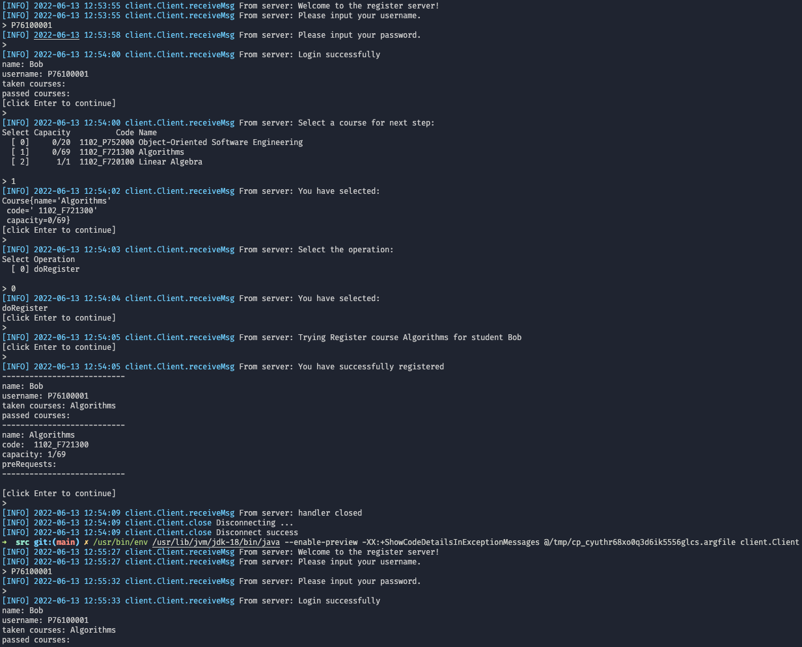

# OOPSE Homework 6

- name: 李易庭
- dept.: 資工碩一
- stu. id: P7610 4419

---
[toc]

---


## Project Structure

There are 6 packages for this project.

```sh
.
├── client
│   └── Client.java
├── server
│   ├── ClientHandler.java
│   └── Server.java
├── data
│   └── MockDB.java
├── models
│   ├── course
│   │   └── Course.java
│   ├── exceptions
│   │   ├── AlreadyTakenException.java
│   │   ├── CourseException.java
│   │   ├── IsFullException.java
│   │   └── NotPassedException.java
│   ├── roles
│   │   ├── AdminRole.java
│   │   ├── RoleBase.java
│   │   └── StudentRole.java
│   └── users
│       ├── Admin.java
│       ├── Student.java
│       └── User.java
├── services
│   ├── AdminService.java
│   └── StudentService.java
└── utils
    ├── CLIParser.java
    ├── LogFormatter.java
    └── securities
        └── Hash.java
```

---

## Sequence diagram


---

## Illustrations
### the course is full


### student has passed the course


### student has taken the course


### student doesn't meet the pre-requests, and without permission


### student doesn't meet the pre-requests, but with permission


### normally successfully register


---

## client package
The client package provides the client node's operations.

### client.Client class
The client package provides an entry to the server
and uses the console as a user interaction interface.
```java
package client;

import java.util.logging.Logger;

import utils.LogFormatter;

import java.io.*;
import java.net.*;


/**
 * The client class.
 */
public class Client {
    // The logger for this class.
    private final static Logger log = LogFormatter.getConsoleLogger(Client.class.getName());

    // The client running state.
    private boolean isRunning= true;

    // The client socket
    private Socket socket;
    
    // The input stream from the client socket.
    private DataInputStream in;

    // The output stream from the client socket.
    private DataOutputStream out;


    /**
     * The constructor of Client.
     * would handle the IOException.
     * 
     * @param addr The address of the server.
     * @param port The port of the server.
     */
    public Client(String addr, int port) {
        try {
            setSocket(new Socket(addr, port));
            setIn(new DataInputStream(socket.getInputStream()));
            setOut(new DataOutputStream(socket.getOutputStream()));
        } catch (IOException e) {
            log.warning("Client init error:" + e);
        }
    }

    /**
     * The main method of Client.
     * 
     * @param args
     */
    public static void main(String[] args) {
        // Create a client.
        Client c = new Client("localhost", 9090);

        // try to start the client.
        try {
            c.start();

        // if occur any IOException, print the error message
        // and exit with status code -1.
        } catch (IOException e) {
            e.printStackTrace();
            System.exit(-1);
        }
    }

    /**
     * Start the client.
     * 
     * @throws IOException If the client occur any IOException.
     */
    public void start() throws IOException {
        String rec; // Received string
        String res; // responseMsg string

        try {
            rec = receiveMsg();
            // In the following loop, the client and client handle exchange data.
            while (isRunning()) {
                // get message from server.
                rec = receiveMsg();

                // get response message from user input.
                // here we use a simple console input.
                // you can use a GUI input or others.
                res = getUserInput(rec);

                // send message to server.
                responseMsg(res);
            }

        // close the client.
        } finally {
            close();
        }
    }

    /**
     * Receive the message from the server.
     * 
     * @return the message string.
     */
    private String receiveMsg() {
        // check the client is running.
        if (!isRunning()) return null;

        try {
            // try to receive message.
            String rec = in.readUTF();

            // print the received message.
            log.info("From server: " + rec);

            // check if the message is "Exit".
            if (rec.equals("handler closed")) {
                // close the client.
                close();
                // exit the method.
                return null;
            }

            // return the received message.
            return rec;

        // if receive message error, then close the client.
        } catch (IOException e) {
            log.warning("Receive message error:" + e);
            close();
        }

        return null;
    }

    /**
     * Send the message to the server.
     * 
     * @param msg the message to send.
     */
    private void responseMsg(String msg) {
        // check the client is running.
        if (!isRunning()) return;

        // try to send message.
        try {
            out.writeUTF(msg);

        // if send message error, then close the client.
        } catch (IOException e) {
            log.warning("Send message error:" + e);
        }
    }

    /**
     * Get the user input by console.
     * 
     * @param rec the received message from server.
     * @return the message.
     */
    private String getUserInput(String rec) {
        // check if the client is running.
        if (!isRunning()) return null;

        // Create a console to get user input.
        Console con = System.console();

        // if password is needed.
        if (rec.equals("Please input your password.")) {
            return String.valueOf(con.readPassword("> "));
        }

        // get user input.
        String msg = con.readLine("> ");

        // if the user input is "Exit", then close the client.
        if (msg.equals("Exit")) {
            close();
        }

        return msg;
    }

	/**
	 * Close the client.
	 * 
	 * This function would do following step:
	 * 1. try to send close message for server.
	 * 2. close the socket and input/output stream,
	 * 3. set isRunning to false.
	 */
	private void close() {
        // check the client is running.
        if (!isRunning()) return;

		log.info("Disconnecting ...");

        // try to send close message for server.
        try {
            out.writeUTF("Exit");
        } catch(IOException e) {}

		try {
			// closing resources
			in.close();
			out.flush();
			out.close();
			socket.close();
			setIsRunning(false);
			log.info("Disconnect success");
		} catch (IOException e) {
			log.severe("Client can't be closed");
			e.printStackTrace();
		}
	}

    public DataInputStream getIn() {
        return in;
    }

    public void setIn(DataInputStream in) {
        this.in = in;
    }

    public DataOutputStream getOut() {
        return out;
    }

    public void setOut(DataOutputStream out) {
        this.out = out;
    }

    public Socket getSocket() {
        return socket;
    }

    public void setSocket(Socket socket) {
        this.socket = socket;
    }

    public boolean isRunning() {
        return isRunning;
    }

    public void setIsRunning(boolean isRunning) {
        this.isRunning = isRunning;
    }
}

```

---

## server package
The server package contains 2 classes, ClientHandler and Server.

### server.Server class
The server class could be specified the port number and other configurations.
```java
package server;

import java.io.*;
import java.net.*;
import java.util.logging.Logger;

import data.MockDB;
import utils.LogFormatter;

/**
 * The server class.
 */
public class Server {
	// The logger for this class.
	private final static Logger log = LogFormatter.getFileHandlerLogger(Server.class.getName());

	// The server running state.
	private static boolean isRunning = true;

	// The server socket
	private static ServerSocket socket;

	// The port number of the server.
	private int port = 9090;

	// The database.
	private MockDB db = new MockDB();


	/**
	 * The constructor of Server.
	 * 
	 * @throws IOException if the server socket can not be created.
	 */
	public Server() throws IOException {
		try {
			socket = new ServerSocket(port);
			log.info("Server is running on port " + port);
		} catch (IOException e) {
			log.severe("Server can't be started on port " + port);
			throw e;
		}
	}

	/**
	 * Start the server.
	 * 
	 * @throws IOException if the server socket can not be created.
	 */
	public void serving() throws IOException {
		while (isRunning) {
			try {
				Socket clientSocket = null;
				// getting client request.
				clientSocket = socket.accept();
				log.info("Client " + clientSocket + " connected");

				// obtaining input and out streams from client socket.
				DataInputStream in = new DataInputStream(clientSocket.getInputStream());
				DataOutputStream out = new DataOutputStream(clientSocket.getOutputStream());

				// starting new thread for client.
				Thread clientHandler = new ClientHandler(clientSocket, in, out, db);
				clientHandler.start();
			} catch (Exception e) {
				log.severe("Server can't be started on port " + port);
				throw new IOException(e);
			}
		}
	}

	/**
	 * The main method.
	 * 
	 * @param args
	 * @throws IOException
	 */
	public static void main(String[] args) throws IOException {
		Server s = new Server();
		s.serving();
		s.close();
	}

	/**
	 * Close the server.
	 */
	private void close() {
		try {
			setRunning(false);
			socket.close();
			log.fine("Server resources are closed");
		} catch (IOException e) {
			e.printStackTrace();
			log.severe("Server can't be closed");
		}
	}

	public int getPort() {
		return port;
	}

	public void setPort(int port) {
		this.port = port;
	}

	public static ServerSocket getSocket() {
		return socket;
	}

	public static void setSocket(ServerSocket socket) {
		Server.socket = socket;
	}

	public static boolean isRunning() {
		return isRunning;
	}

	public static void setRunning(boolean isRunning) {
		Server.isRunning = isRunning;
	}

}
```

### server.ClientHandler class
The client handler class provides the services for the client to communicate with the server.
It extends the thread class and implements the run() method.
```java
package server;

import java.io.DataInputStream;
import java.io.DataOutputStream;
import java.io.IOException;
import java.net.Socket;
import java.util.ArrayList;
import java.util.logging.Logger;

import data.MockDB;
import models.course.Course;
import models.exceptions.CourseException;
import models.users.Admin;
import models.users.Student;
import models.users.User;
import services.AdminService;
import services.StudentService;
import utils.LogFormatter;

/**
 * The client handler.
 * 
 * provides the services for the client to communicate with the server.
 * extends the thread class, and implements the run() method.
 */
class ClientHandler extends Thread {
	// The logger for this class.
	private final static Logger log = LogFormatter.getFileHandlerLogger(Server.class.getName());

	// A client handler running state.
	private boolean isRunning = true;

	// The client socket
	private Socket socket;

	// The input stream from the client socket.
	private DataInputStream in;

	// The output stream from the client socket.
	private DataOutputStream out;

	// The user that is currently logged in.
	private User user;

	// The database.
	private MockDB db;

	// Operation provide a tag for student and course relationship operation.
	private enum Operation {
		doRegister,
		// doUnregister,
		// doPass,
		// doFail,
	};
	

	/**
	 * The constructor of ClientHandler.
	 * 
	 * @param socket
	 * @param in
	 * @param out
	 * @param db
	 */
	public ClientHandler(Socket socket, DataInputStream in, DataOutputStream out, MockDB db) {
        setSocket(socket);
        setIn(in);
        setOut(out);
		setDb(db);
	}

	@Override
	public void run() {
		try {
			// Welcome message.
			responseMsg("Welcome to the register server!");

			// login for next step.
			handleLogin();

			// Get the course, student and operation from the client.
			Course course = selectCourse();
			Student student = selectStudent();
			String operation = selectOperation();

			// handle the operation.
			switch (operation) {
				case "doRegister":
					doRegisterOperation(student, course);
					break;

				// We can add more operations here.
				// like following:
				// case "doUnregister":
				// 	doUnregisterOperation(student, course);
				// 	break;
				// case "doPass":
				// 	doPassOperation(student, course);
				// 	break;
				// case "doFail":
				// 	doFailOperation(student, course);
				// 	break;
				
			}
		
		} catch (IOException | NullPointerException e) {
			log.warning(clientString() + " disconnected caused by: " + e);
		} finally {
			close();
		}
	}

	/**
	 * Select the operation.
	 * 
	 * @return the operation string.
	 * @throws IOException if the client is disconnected.
	 */
	private String selectOperation() throws IOException {
		if (!isRunning) return null;
		// get the operation string list.
		ArrayList<String> operations = new ArrayList<>(){{
			for (Operation opt : Operation.values()) {
				add(opt.name());
			}
		}};

		StringBuilder sb = new StringBuilder();
		sb.append(String.format("%6s %s\n", "Select", "Operation"));
        for (int i=0; i<operations.size(); i++) {
            String opt = operations.get(i);
            sb.append(String.format("  [%2d] %s\n", i, opt));
        }

		log.info(operations.toString());

		return selectFromList(
			operations,
			"Select the operation:\n" +
				sb.toString()
		);
	}

	/**
	 * Select a course from the list of courses.
	 * 
	 * @return the selected course.
	 * @throws IOException if the client is disconnected.
	 */
	private Course selectCourse() throws IOException {
		if (!isRunning) return null;
		return selectFromList(
			db.courses,
			"Select a course for next step: \n" +
				Course.getCourseListString(db.courses)
		);
	}

	/**
	 * Select a student from the list.
	 * 
	 * @return the selected student.
	 * @throws IOException if the client is closed.
	 */
	private Student selectStudent() throws IOException {
		if (!isRunning) return null;

		return (user instanceof Admin) ? 
			// get student to take this course.
			selectFromList(
				db.getStudents(),
				"Select a student for next operation: \n" +
					Student.getStudentLiString(db.getStudents())
			) :
			(Student) user;
	}

	/**
	 * Handle the register course request.
	 * 
	 * @param student the student to register.
	 * @param course the course to register.
	 * @throws IOException if any error occurs.
	 */
	private void doRegisterOperation(Student student, Course course) throws IOException, NullPointerException {
		if (!isRunning) return;

		silentResponseMsg(
			"Trying Register course " + course.getName() +
			" for student " + student.getName()
		);

		try {
			if (user instanceof Admin) {
				AdminService.takeCourse(student, course);
			} else if (user instanceof Student) {
				StudentService.takeCourse(student, course);
			}
			silentResponseMsg(
				"You have successfully registered\n" +
				"---------------------------\n" + 
				student.getInfoString() + "\n" +
				"---------------------------\n" + 
				course.getInfoString() + "\n" +
				"---------------------------\n"
			);

		} catch (CourseException ce) {
			silentResponseMsg(ce.getMessage());
		}
	}

	/**
	 * provide a generic method for client to select the target from a list.
	 * 
	 * @param <T> the type of the target.
	 * @param list the list to select from.
	 * @param prompt the prompt message.
	 * @return the target.
	 * @throws IOException 
	 */
	private <T> T selectFromList(ArrayList<T> list, String prompt) throws IOException {
		if (!isRunning) return null;
		int idx;
		T target;

		// send prompt.
		for (;;) {
			responseMsg(prompt);
			if (!isRunning) return null;

			// get response.
			String rec = receiveMsg();

			// check if the index is valid.
			try {
				// can be parse to int.
				idx = Integer.parseInt(rec);

				// is valid.
				if (idx < 0 || idx >= db.courses.size())
					throw new NumberFormatException();

			} catch (NumberFormatException e) {
				// send error message to client.
				log.warning(e.toString());
				silentResponseMsg("Invalid select");
				continue;
			}

			// get target
			target = list.get(idx);

			silentResponseMsg(
				"You have selected:\n" +
				target.toString().replace(',', '\n'));
			return target;
		}
	}

	/**
	 * Handle the login request.
	 * 
	 * @throws IOException
	 */
	private void handleLogin() {
		if (!isRunning) return;

		String prompt = "Please input your username.";
		responseMsg(prompt);

		for (;;) {
			if (!isRunning) return;

			// receive username from client.
			String username = receiveMsg();

			// check the username is in the database.
			User tmpUser = db.getUserByUsername(username);

			// if the user is not in the database, send error message.
			// and ask the client to input again.
			if (tmpUser == null) {
				responseMsg("username not found!\nusername: ");
				continue;
			}

			// if the user is in the database,
			// ask the client to input the password.
			responseMsg("Please input your password.");
			String password = receiveMsg();

			// check the password.
			if (tmpUser.checkPassword(password)) {
				user = tmpUser;
				silentResponseMsg(
					"Login successfully\n" +
					user.getInfoString());
				break;
			}

			// the password is not correct,
			responseMsg("Invalid password!\n" + prompt);
		}
	}

	/**
	 * Response a message to client.
	 * 
	 * @param msg the message to response.
	 */
	private void responseMsg(String msg) {
		log.fine("Sending message to " + clientString() + ": " + msg);

		// if the handler is not running, then return.
		if (!isRunning) return;

		// try to send message to client.
		try {
			out.writeUTF(msg);
		
		// if the client is disconnected, then stop the handler.
		} catch (IOException e) {
			log.info(clientString() + " be forced disconnected.");
			close();
		}
	}

	/**
	 * Silently response a message to client.
	 * 
	 * @param msg the message to response.
	 */
	private void silentResponseMsg(String msg) {
		responseMsg(msg + "\n[click Enter to continue]");
		receiveMsg();
	}


	/**
	 * Receive the message from client.
	 * 
	 * @return the message.
	 */
	private String receiveMsg() {
		String msg="";
		log.info("Waiting for " + clientString() + " message...");

		// try to receive message.
		try {
			msg = in.readUTF();

		// if the client is disconnected, then stop the handler.
		} catch (IOException e) {
			log.info(clientString() + " be forced disconnected.");
			close();
			return null;
		}

		// show the received message.
		if (msg.equals("Exit")) {
			close();
		}

		log.info(clientString() + " sent: " + msg);
		return msg;
	}

	/**
	 * Close the handler.
	 * 
	 * This function would do following step:
	 * 1. try to send close message for client.
	 * 2. close the socket and input/output stream,
	 * 3. set isRunning to false.
	 */
	private void close() {
		log.info(clientString() + " disconnecting ...");
		try {
			out.writeUTF("handler closed");
		} catch(IOException e) {}

		try {
			// closing resources
			in.close();
			out.flush();
			out.close();
			socket.close();
			setIsRunning(false);
			log.info(clientString() + " disconnected.");
		} catch (IOException e) {
			log.severe("Handler can't be closed");
			e.printStackTrace();
		}
	}
	
	/**
	 * Get the login status.
	 * 
	 * @return true if user is login
	 */
	public boolean isUserLogin() {
		return user != null;
	}

	private String clientString() {
		return "Client " + socket.getInetAddress() + ":" + socket.getPort();
	}

    public DataInputStream getIn() {
        return in;
    }

    public void setIn(DataInputStream in) {
        this.in = in;
    }

    public DataOutputStream getOut() {
        return out;
    }

    public void setOut(DataOutputStream out) {
        this.out = out;
    }

    public Socket getSocket() {
        return socket;
    }

    public void setSocket(Socket socket) {
        this.socket = socket;
    }

	public MockDB getDb() {
		return db;
	}

	public void setDb(MockDB db) {
		this.db = db;
	}

	public void setIsRunning(boolean isRunning) {
		this.isRunning = isRunning;
	}

	public boolean isRunning() {
		return isRunning;
	}
}

```

---
## data package
The data package provides the data repositories and other database operations.

### data.MockDB class
The MockDB class provides a mock data for illustrate the project,
you also could replace it by your own database.
```java
package data;

import java.util.ArrayList;

import models.course.Course;
import models.exceptions.CourseException;
import models.users.Admin;
import models.users.Student;
import models.users.User;
import services.StudentService;

/**
 * This class is used to store all the mock data of the application.
 * You could replace it by a real database or a file.
 */
public class MockDB {
    public ArrayList<User> users = new ArrayList<User>(){
        {
            // Add student users.
            add(new Student(0, "Alice", "P76100000", "abc123"));
            add(new Student(1, "Bob", "P76100001", "abc123"));

            // Add admin user.
            add(new Admin(0, "Charlie", "admin", "admin"));
        }
    };

    public ArrayList<Course> courses = new ArrayList<Course>(){
        {
            try {
                // Add some classes.
                add(new Course("Object-Oriented Software Engineering", " 1102_P752000", 20));
                add(new Course("Algorithms", " 1102_F721300", 69));
                add(new Course("Linear Algebra", " 1102_F720100", 1));
            } catch (IllegalAccessException e) {
                e.printStackTrace();
            }
        }
    };

    public MockDB() {
        Student alice = (Student) users.get(0);
        Course oose = courses.get(0);
        Course algo = courses.get(1);
        Course la = courses.get(2);

        // Set algorithms as pre-requests of oose.
        oose.setPreRequests(new ArrayList<>(){{add(algo);}});

        // Set Alice passed algorithms.
        StudentService.passCourse(alice, algo);

        // Set Alice taken linear algebra.
        try {
            StudentService.takeCourse(alice, la);
        } catch (CourseException e) {}
    }

    public User getUserByUsername(String username) {
        for (User user : users) {
            if (user.getUsername().equals(username)) {
                return user;
            }
        }
        return null;
    }

    public Course getCourseByCode(String code) {
        for (Course course : courses) {
            if (course.getCode().equals(code)) {
                return course;
            }
        }
        return null;
    }


    public ArrayList<Student> getStudents() {
        ArrayList<Student> students = new ArrayList<>();
        for (User user : users) {
            if (user instanceof Student) {
                students.add((Student) user);
            }
        }
        return students;
    }

    public String getStudentList() {
        StringBuilder sb = new StringBuilder();
        int idx = 0;
        for (Student student : getStudents()) {
            sb.append(++idx + ' ').append(student.getUsername()).append(" ").append(student.getName()).append("\n");
        }
        return sb.toString();
    }

    public Student getStudentByUsername(String username) {
        for (Student student : getStudents()) {
            if (student.getUsername().equals(username)) {
                return student;
            }
        }
        return null;
    }
}

```

---
## models package
The models package provides all the data schemes and models.

### models.course package
This package provide all the course models,
but in this project we only implement a class, Course class.

#### models.course.Course class
This class provides a model and scheme for course.
```java
package models.course;

import java.util.ArrayList;

import models.users.Student;

/**
 * The Course class.
 */
public class Course {
    private ArrayList<String> allCourses = new ArrayList<String>();
    private ArrayList<Course> preRequests = new ArrayList<>();
    private ArrayList<Student> students = new ArrayList<>();
    private String name;
    private String code;
    private int maxStudents;

    /**
     * The constructor of Course.
     * 
     * @param name The name of the course.
     * @param code The code of the course.
     * @param maxStudents The maximum number of students in the course.
     * @throws IllegalAccessException If the course code is already in use.
     */
    public Course(String name, String code, int maxStudents) throws IllegalAccessException {
        this.setName(name);
        this.setCode(code);
        this.setMaxStudents(maxStudents);
    }

    /**
     * The constructor of Course.
     * 
     * @param name The name of the course.
     * @param code The code of the course.
     * @param maxStudents The maximum number of students in the course.
     * @param preRequests The pre-requests of the course.
     * @throws IllegalAccessException If the course code is already in use.
     */
    public Course(String name, String code, int maxStudents, ArrayList<Course> preRequests) throws IllegalAccessException {
        this(name, code, maxStudents);
        setPreRequests(preRequests);
    }

    @Override
    public String toString() {
        return "Course{" +
                "name='" + name + '\'' +
                ", code='" + code + '\'' +
                ", capacity=" + capacityString() +
                '}';
    }

    /**
     * Return a formatted string of the course information.
     * 
     * @return A formatted string.
     */
    public String getInfoString() {
        return "name: " + name +
               "\ncode: " + code +
               "\ncapacity: " + capacityString() +
               "\npreRequests: " + getCourseString(preRequests);
    }

    /**
     * Return all courses' names.
     * 
     * @param courses The courses.
     * @return A formatted string.
     */
    public static String getCourseString(ArrayList<Course> courses) {
        ArrayList<String> response = new ArrayList<>();
        for (Course course: courses) {
            response.add(course.getName());
        }
        return String.join(", ", response);
    }

    /**
     * Return a formatted string of the courses' information.
     * 
     * @param courses The courses.
     * @return A formatted string.
     */
    public static String getCourseListString(ArrayList<Course> courses) {
        StringBuilder sb = new StringBuilder();
        sb.append(String.format("%6s %8s %13s %s\n", "Select", "Capacity", "Code", "Name"));
        for (int i=0; i<courses.size(); i++) {
            Course course = courses.get(i);
            sb.append(String.format("  [%2d] %8s %13s %s\n", i, course.capacityString(), course.getCode(), course.getName()));
        }
        return sb.toString();
    }

    /**
     * Return a formatted string of the course capacity.
     * 
     * @return The formatted string.
     */
    public String capacityString() {
        return students.size() + "/" + maxStudents;
    }

    public ArrayList<Course> getPreRequests() {
        return preRequests;
    }
    public void setPreRequests(ArrayList<Course> preRequests) {
        this.preRequests = preRequests;
    }
    public ArrayList<Student> getStudents() {
        return students;
    }
    public void setStudents(ArrayList<Student> students) {
        this.students = students;
    }
    public String getName() {
        return name;
    }
    public void setName(String name) {
        this.name = name;
    }
    public String getCode() {
        return code;
    }
    public void setCode(String code) throws IllegalAccessException {
        // Check if the course code is valid.
        if (allCourses.contains(code)) {
            throw new IllegalArgumentException("Course code already exists.");
        }
        this.code = code;
    }
    public int getMaxStudents() {
        return maxStudents;
    }
    public void setMaxStudents(int maxStudents) {
        this.maxStudents = maxStudents;
    }
}

```

### models.exceptions package
This package provides all custom exceptions for this project.

#### models.exceptions.CourseException class
This class provides a elementary exception for course operations.
```java
package models.exceptions;

public class CourseException extends Exception {
    /**
     * Constructs an {@code CourseException} with the specified detail message.
     */
    public CourseException() {
        super();
    }

    /**
     * Constructs an {@code CourseException} with the specified detail message.
     * 
     * @param message The detail message.
     */
    public CourseException(String message) {
        super(message);
    }

    /**
     * Constructs an {@code CourseException} with the specified detail message
     * and cause.
     *
     * <p> Note that the detail message associated with {@code cause} is
     * <i>not</i> automatically incorporated into this exception's detail
     * message.
     *
     * @param message
     *        The detail message (which is saved for later retrieval
     *        by the {@link #getMessage()} method)
     *
     * @param cause
     *        The cause (which is saved for later retrieval by the
     *        {@link #getCause()} method).  (A null value is permitted,
     *        and indicates that the cause is nonexistent or unknown.)
     */
    public CourseException(String message, Throwable cause) {
        super(message, cause);
    }

    /**
     * Constructs an {@code CourseException} with the specified cause and a
     * detail message of {@code (cause==null ? null : cause.toString())}
     * (which typically contains the class and detail message of {@code cause}).
     * This constructor is useful for IsFull exceptions that are little more
     * than wrappers for other throwables.
     *
     * @param cause
     *        The cause (which is saved for later retrieval by the
     *        {@link #getCause()} method).  (A null value is permitted,
     *        and indicates that the cause is nonexistent or unknown.)
     */
    public CourseException(Throwable cause) {
        super(cause);
    }
}

```

#### models.exceptions.AlreadyTakenException class
This class extends the `models.exceptions.CourseException` class would be thrown if the student has taken the course. 
```java
package models.exceptions;

public class AlreadyTakenException extends CourseException {
    /**
     * Constructs an {@code AlreadyTakenException} with the specified detail message.
     */
    public AlreadyTakenException() {
        super();
    }

    /**
     * Constructs an {@code AlreadyTakenException} with the specified detail message.
     * 
     * @param message The detail message.
     */
    public AlreadyTakenException(String message) {
        super(message);
    }

    /**
     * Constructs an {@code AlreadyTakenException} with the specified detail message
     * and cause.
     *
     * <p> Note that the detail message associated with {@code cause} is
     * <i>not</i> automatically incorporated into this exception's detail
     * message.
     *
     * @param message
     *        The detail message (which is saved for later retrieval
     *        by the {@link #getMessage()} method)
     *
     * @param cause
     *        The cause (which is saved for later retrieval by the
     *        {@link #getCause()} method).  (A null value is permitted,
     *        and indicates that the cause is nonexistent or unknown.)
     */
    public AlreadyTakenException(String message, Throwable cause) {
        super(message, cause);
    }

    /**
     * Constructs an {@code AlreadyTakenException} with the specified cause and a
     * detail message of {@code (cause==null ? null : cause.toString())}
     * (which typically contains the class and detail message of {@code cause}).
     * This constructor is useful for IsFull exceptions that are little more
     * than wrappers for other throwables.
     *
     * @param cause
     *        The cause (which is saved for later retrieval by the
     *        {@link #getCause()} method).  (A null value is permitted,
     *        and indicates that the cause is nonexistent or unknown.)
     */
    public AlreadyTakenException(Throwable cause) {
        super(cause);
    }
}

```

#### models.exceptions.IsFullException class
This class extends the `models.exceptions.CourseException` class would be thrown if the course has been fully taken. 
```java
package models.exceptions;

public class IsFullException extends CourseException {
    /**
     * Constructs an {@code IsFullException} with the specified detail message.
     */
    public IsFullException() {
        super();
    }

    /**
     * Constructs an {@code IsFullException} with the specified detail message.
     * 
     * @param message The detail message.
     */
    public IsFullException(String message) {
        super(message);
    }

    /**
     * Constructs an {@code IsFullException} with the specified detail message
     * and cause.
     *
     * <p> Note that the detail message associated with {@code cause} is
     * <i>not</i> automatically incorporated into this exception's detail
     * message.
     *
     * @param message
     *        The detail message (which is saved for later retrieval
     *        by the {@link #getMessage()} method)
     *
     * @param cause
     *        The cause (which is saved for later retrieval by the
     *        {@link #getCause()} method).  (A null value is permitted,
     *        and indicates that the cause is nonexistent or unknown.)
     */
    public IsFullException(String message, Throwable cause) {
        super(message, cause);
    }

    /**
     * Constructs an {@code IsFullException} with the specified cause and a
     * detail message of {@code (cause==null ? null : cause.toString())}
     * (which typically contains the class and detail message of {@code cause}).
     * This constructor is useful for IsFull exceptions that are little more
     * than wrappers for other throwables.
     *
     * @param cause
     *        The cause (which is saved for later retrieval by the
     *        {@link #getCause()} method).  (A null value is permitted,
     *        and indicates that the cause is nonexistent or unknown.)
     */
    public IsFullException(Throwable cause) {
        super(cause);
    }
}

```

#### models.exceptions.NotPassedException class
This class extends the `models.exceptions.CourseException` class would be thrown if the student doesn't passed the pre-requests of the course. 
```java
package models.exceptions;

public class NotPassedException extends CourseException {
    /**
     * Constructs an {@code NotPassedException} with the specified detail message.
     */
    public NotPassedException() {
        super();
    }

    /**
     * Constructs an {@code NotPassedException} with the specified detail message.
     * 
     * @param message The detail message.
     */
    public NotPassedException(String message) {
        super(message);
    }

    /**
     * Constructs an {@code NotPassedException} with the specified detail message
     * and cause.
     *
     * <p> Note that the detail message associated with {@code cause} is
     * <i>not</i> automatically incorporated into this exception's detail
     * message.
     *
     * @param message
     *        The detail message (which is saved for later retrieval
     *        by the {@link #getMessage()} method)
     *
     * @param cause
     *        The cause (which is saved for later retrieval by the
     *        {@link #getCause()} method).  (A null value is permitted,
     *        and indicates that the cause is nonexistent or unknown.)
     */
    public NotPassedException(String message, Throwable cause) {
        super(message, cause);
    }

    /**
     * Constructs an {@code NotPassedException} with the specified cause and a
     * detail message of {@code (cause==null ? null : cause.toString())}
     * (which typically contains the class and detail message of {@code cause}).
     * This constructor is useful for IsFull exceptions that are little more
     * than wrappers for other throwables.
     *
     * @param cause
     *        The cause (which is saved for later retrieval by the
     *        {@link #getCause()} method).  (A null value is permitted,
     *        and indicates that the cause is nonexistent or unknown.)
     */
    public NotPassedException(Throwable cause) {
        super(cause);
    }
}

```

### models.roles package
This package provides all interfaces of each role, so all files in this package must be a interface. 

#### models.roles.RoleBase abstract interface
This abstract interface defines all methods of a role should be implemented.
```java
package models.roles;

public abstract interface RoleBase {
    public abstract void setId(int paramInt);

    public abstract int getId();

    public abstract void setName(String paramString);

    public abstract String getName(); 

    public abstract void setUsername(String paramString);

    public abstract String getUsername(); 

    public abstract void setPassword(String paramString);

    public abstract boolean checkPassword(String paramString);

    public abstract void setPermission(int paramInt);

    public abstract int getPermission();
}

```

#### models.roles.AdminRole interface
This interface extends the `models.roles.RoleBase` interface
and it provides the characteristic methods for the `model.users.Admin` class.
```java
package models.roles;

public interface AdminRole extends RoleBase {
    
}

```

#### models.roles.StudentRole interface
This interface extends the `models.roles.RoleBase` interface
and it provides the characteristic methods for the `model.users.Student` class.
```java
package models.roles;

public interface StudentRole extends RoleBase {

}
```

### models.users package
This package provides all classes of each user, so all files in this package must be a class.

#### models.users.User abstract class
This abstract class defines all attributes of a user should have.
```java
package models.users;

import java.security.spec.InvalidKeySpecException;

import models.roles.RoleBase;
import utils.Hash;

/**
 * The User class.
 */
public abstract class User implements RoleBase {
    // The id of the user.
    private int id;

    // The name of the user.
    private String name;

    // The username of the user.
    private String username;

    // The hashed password of the user.
    private byte[] password; 

    // The role of the user.
    private int permission;

    /**
     * The constructor of User.
     * 
     * @param id The id of the user.
     * @param name The name of the user.
     * @param username The username of the user.
     * @param password The password of the user.
     * @param permission The permission of the user.
     */
    public User(int id, String name, String username, String password, int permission) {
        setId(id);
        setName(name);
        setUsername(username);
        setPassword(password);
        setPermission(permission);
    }

    // A abstract method to get formatted string of user information.
    public abstract String getInfoString();

    @Override
    public void setId(int paramInt) {
        this.id = paramInt;
    }

    @Override
    public int getId() {
        return id;
    }

    @Override
    public void setName(String paramString) {
        name = paramString;
    }

    @Override
    public String getName() {
        return name;
    }

    @Override
    public void setPassword(String paramString) {
        try {
            password = Hash.hash(paramString);
        } catch (InvalidKeySpecException e) {
            e.printStackTrace();
        }
    }

    @Override
    public boolean checkPassword(String paramString) {
        try {
            return Hash.check(paramString, password);
        } catch (InvalidKeySpecException e) {
            e.printStackTrace();
        }
        return false;
    }

    @Override
    public void setPermission(int paramInt) {
        permission = paramInt;
    }

    @Override
    public int getPermission() {
        return permission;
    }

    @Override
    public String getUsername() {
        return username;
    }

    @Override
    public void setUsername(String username) {
        this.username = username;
    }
}

```

#### models.users.Admin class
This class extends the `models.users.User` class
and it provides the characteristic abstract for the Admin user.
It also implements all interfaces of `models.roles.AdminRole`.
```java
package models.users;

import models.roles.AdminRole;

/**
 * The Admin class.
 */
public class Admin extends User implements AdminRole {
    /**
     * The constructor of Admin.
     * the admin would have permission status of 1.
     * 
     * @param id The id of the admin.
     * @param name The name of the admin.
     * @param username The username of the admin.
     * @param password The password of the admin.
     */
    public Admin(int id, String name, String username, String password) {
        super(id, name, username, password, 1);
    }

    @Override
    public String getInfoString() {
        return "name: " + getName() +
               "\nusername: " + getUsername();
    }
}

```

#### models.users.Student class
This class extends the `models.users.User` class
and it provides the characteristic abstract for the Student user.
It also implements all interfaces of `models.roles.StudentRole`.
```java
package models.users;

import java.util.ArrayList;

import models.course.Course;
import models.roles.StudentRole;

/**
 * The Student class.
 */
public class Student extends User implements StudentRole {
    // The courses that the student has registered.
    private ArrayList<Course> register = new ArrayList<>();

    // The courses that the student has passed.
    private ArrayList<Course> passed = new ArrayList<>();

    /**
     * The constructor of Student.
     * 
     * @param id The id of the student.
     * @param name The name of the student.
     * @param username The username of the student.
     * @param password The password of the student.
     */
    public Student(int id, String name, String username, String password) {
        super(id, name, username, password, 0);
    }

    @Override
    public String toString() {
        return "Student{" +
                "name=" + getName() +
                ", registered=" + Course.getCourseString(register) +
                ", passed=" + Course.getCourseString(passed) +
                '}';
    }

    /**
     * Return a formatted string of the student information.
     * 
     * @return A formatted string.
     */
    public String getInfoString() {
        return "name: " + getName() +
               "\nusername: " + getUsername() +
               "\ntaken courses: " + Course.getCourseString(register) +
               "\npassed courses: " + Course.getCourseString(passed);
    }

    /**
     * Return a formatted string of the students' information.
     * 
     * @param students The students.
     * @return The formatted string.
     */
    public static String getStudentLiString(ArrayList<Student> students) {
        StringBuilder sb = new StringBuilder();

        sb.append(String.format("%6s %10s %s\n", "Select", "Username", "Name"));

        for (int i=0; i<students.size(); i++) {
            Student student = students.get(i);
            sb.append(String.format("  [%2d] %10s %s\n", i, student.getUsername(), student.getName()));
        }

        return sb.toString();
    }

    public ArrayList<Course> getPassed() {
        return passed;
    }

    public void setPassed(ArrayList<Course> passed) {
        this.passed = passed;
    }

    public ArrayList<Course> getRegister() {
        return register;
    }

    public void setRegister(ArrayList<Course> register) {
        this.register = register;
    }
}

```

---

## services package
This package provides all related operations for models.
All service classes' methods must be implemented by
`public synchronized static` decorators.
Here the `synchronized` is provided from Java,
and it's used to ensure only one thread could access at the same time in a multi-threading situation.

### services.AdminService class
This class provides all operations to admins and courses.
```java
package services;

import models.course.Course;
import models.exceptions.AlreadyTakenException;
import models.exceptions.CourseException;
import models.exceptions.IsFullException;
import models.users.Student;

/**
 * The service for Admin.
 */
public class AdminService {
    /**
     * Make a student to take a course.
     * 
     * @param student The student.
     * @param course The course.
     * @throws CourseException If the course is full.
     * @throws CourseException If the student has already registered.
     */
    public synchronized static void takeCourse(Student student, Course course) throws CourseException {
        if (course.getMaxStudents() <= course.getStudents().size()) {
            throw new IsFullException(
                "The course have been fully taken:\n" +
                "--------------------\n" + 
                course.getInfoString() + "\n" +
                "--------------------\n"
            );
        }
        if (student.getRegister().contains(course)) {
            throw new AlreadyTakenException(
                "The student has already registered:\n" +
                "--------------------\n" + 
                student.getInfoString() + "\n" +
                "--------------------\n"
            );
        }
        if (student.getPassed().contains(course)) {
            throw new AlreadyTakenException(
                "The student has already passed:\n" +
                "--------------------\n" + 
                student.getInfoString() + "\n" +
                "--------------------\n"
            );
        }
        // without pre-requests
        student.getRegister().add(course);
        course.getStudents().add(student);
    }
}

```

### services.StudentService class
This class provides all operations to students and courses.
```java
package services;

import models.course.Course;
import models.exceptions.AlreadyTakenException;
import models.exceptions.CourseException;
import models.exceptions.IsFullException;
import models.exceptions.NotPassedException;
import models.users.Student;

/**
 * The service for student.
 */
public class StudentService {
    /**
     * Take a course.
     * 
     * @param student The student.
     * @param course The course.
     * @throws CourseException If the course is full.
     * @throws CourseException If the student has already registered.
     * @throws CourseException If the student has not passed the pre-requests.
     */
    public synchronized static void takeCourse(Student student, Course course) throws CourseException {
        if (course.getMaxStudents() <= course.getStudents().size()) {
            throw new IsFullException(
                "The course have been fully taken:\n" +
                "--------------------\n" + 
                course.getInfoString() + "\n" +
                "--------------------\n"
            );
        }
        if (student.getRegister().contains(course)) {
            throw new AlreadyTakenException(
                "The student has already registered:\n" +
                "--------------------\n" + 
                student.getInfoString() + "\n" +
                "--------------------\n"
            );
        }
        if (student.getPassed().contains(course)) {
            throw new AlreadyTakenException(
                "The student has already passed:\n" +
                "--------------------\n" + 
                student.getInfoString() + "\n" +
                "--------------------\n"
            );
        }
        if (!checkPreRequests(student, course) ) {
            throw new NotPassedException(
                "The student has not passed the pre-requests:\n" +
                "--------------------\n" + 
                student.getInfoString() + "\n" +
                "--------------------\n" + 
                course.getInfoString() + "\n" +
                "--------------------\n"
            );
        }
        student.getRegister().add(course);
        course.getStudents().add(student);
    }

    /**
     * Check if the student has passed the pre-requests.
     * 
     * @param student The student.
     * @param course The course.
     * @return True if the student has passed the pre-requests.
     */
    public synchronized static boolean checkPreRequests(Student student, Course course) {
        for (Course preRequest : course.getPreRequests()) {
            if (!student.getPassed().contains(preRequest)) {
                return false;
            }
        }
        return true;
    }

    /**
     * Pass a course.
     * 
     * @param student The student.
     * @param course The course.
     */
    public synchronized static void passCourse(Student student, Course course) {
        // We don't need to check if the student has taken the course.
        // We check at {@code StudentService.takeCourse} already.
        student.getPassed().add(course);
    }
}

```

---

## utils package
This package provides some independent tools for others.

### Hash class
This class provides hash and check functions for sensitive data.
```java
package utils;

import java.security.NoSuchAlgorithmException;
import java.security.spec.InvalidKeySpecException;
import java.security.spec.KeySpec;

import javax.crypto.SecretKeyFactory;
import javax.crypto.spec.PBEKeySpec;

/**
 * This class is used to generate/check a hash code for a string.
 */
public class Hash {
    private static byte[] salt = new byte[16];

    public Hash() throws NoSuchAlgorithmException {
    }

    /**
     * Generate a hash code for a string.
     * 
     * @param password The string to generate a hash code for.
     * @return The hash code of the string.
     * @throws InvalidKeySpecException If the password is invalid.
     */
    public static byte[] hash(String password) throws InvalidKeySpecException {
        try {
            SecretKeyFactory factory = SecretKeyFactory.getInstance("PBKDF2WithHmacSHA1");
            KeySpec spec = new PBEKeySpec(password.toCharArray(), salt, 65536, 128);
            byte[] encoded = factory.generateSecret(spec).getEncoded();

            return encoded;
        } catch (NoSuchAlgorithmException e) {
            e.printStackTrace();
            throw new RuntimeException("Error while hashing password", e);
        }
    }

    /**
     * Check if a hash code is valid for a string.
     * 
     * @param password The string to check the hash code for.
     * @param hash The hash code to check.
     * @return True if the hash code is valid for the string.
     * @throws InvalidKeySpecException If the password is invalid.
     */
    public static boolean check(String password, byte[] hash) throws InvalidKeySpecException {
        byte[] test = hash(password);
        if (test.length != hash.length) {
            return false;
        }
        for (int i = 0; i < test.length; i++) {
            if (test[i] != hash[i]) {
                return false;
            }
        }
        return true;
    }
}

```

### CLIParse class
This class provides a more elegant methods to get system arguments.
```java
package utils;

import java.util.HashMap;
import java.util.HashSet;
import java.util.ArrayList;
import java.util.Arrays;
import java.util.List;
import java.util.Set;

/**
 * A command line parser.
 */
public class CLIParser {
    List <String> args = new ArrayList<>();
    HashMap<String, List<String>> map = new HashMap<>();
    Set<String> flags = new HashSet<>();

    public CLIParser(String arguments[])
    {
        this.args = Arrays.asList(arguments);
        map();
    }

    /**
     * Parse the arguments and put them in a map.
     * 
     * @return the map
     */
    public Set<String> getKeys()
    {
        Set<String> argumentNames = new HashSet<>();
        argumentNames.addAll(flags);
        argumentNames.addAll(map.keySet());

        return argumentNames;
    }
    
    /**
     * Check if flag is given
     * 
     * @param flag the flag name
     * @return true if flag is given
     */
    public boolean getFlag(String flagName)
    {
        return flags.contains(flagName);
    }

    /**
     * Return argument value for particular argument name
     * 
     * @param argumentName the argument name
     * @return the argument value if it exists, null otherwise
     */
    public String getVal(String argumentName)
    {
        return map.containsKey(argumentName) ? 
            map.get(argumentName).get(0) :
            null;
    }

    /**
     * Map the flags and argument names with the values 
     */
    public void map()
    {
        for (String arg: args) {
            if (arg.startsWith("-")) {
                if (args.indexOf(arg) == (args.size() - 1)) {
                    flags.add(arg.replace("-", ""));

                } else if (args.get(args.indexOf(arg)+1).startsWith("-")) {
                    flags.add(arg.replace("-", ""));

                } else {
                    //List of values (can be multiple)
                    List<String> argumentValues = new ArrayList<>();
                    int i = 1;
                    while (args.indexOf(arg)+i != args.size() && !args.get(args.indexOf(arg)+i).startsWith("-")) {
                        argumentValues.add(args.get(args.indexOf(arg)+i));
                        i++;
                    }

                    map.put(
                        arg.replace("-", ""),
                        argumentValues
                    );
                }
            }
        }
    }

    public void print()
    {
        System.out.println("Flags: " + flags);
        System.out.println("Arguments: " + map);
    }
}
```

### LogFormatter class
This class provides a colorful and cleaner logger formatter.
```java
package utils;

import java.text.SimpleDateFormat;
import java.util.Date;
import java.util.logging.ConsoleHandler;
import java.util.logging.FileHandler;
import java.util.logging.Formatter;
import java.util.logging.LogRecord;
import java.util.logging.Logger;
import java.util.logging.SimpleFormatter;

/**
 * The LogFormatter class.
 * 
 * provides a custom formatter for the logger.
 */
public class LogFormatter extends Formatter {
    // ANSI escape code
    public static final String RESET = "\u001B[0m";
    public static final String BLACK = "\u001B[30m";
    public static final String RED = "\u001B[31m";
    public static final String GREEN = "\u001B[32m";
    public static final String YELLOW = "\u001B[33m";
    public static final String BLUE = "\u001B[34m";
    public static final String PURPLE = "\u001B[35m";
    public static final String CYAN = "\u001B[36m";
    public static final String WHITE = "\u001B[37m";
    public static final String BOLD = "\033[1m";

    // Here you can configure the format of the output and 
    // its color by using the ANSI escape codes defined above.

    // format is called for every console log message
    @Override
    public String format(LogRecord record) {
        // This example will print date/time, class, and log level in yellow,
        // followed by the log message and it's parameters in white .
        StringBuilder builder = new StringBuilder();
        switch (record.getLevel().getName()) {
            case "SEVERE":
                builder.append(RED);
                break;
            case "WARNING":
                builder.append(YELLOW);
                break;
            case "INFO":
                builder.append(BLUE);
                break;
            case "FINE":
                builder.append(GREEN);
                break;
            default:
                builder.append(WHITE);
                break;
        }
        builder.append("[");
        builder.append(record.getLevel().getName());
        builder.append("] ");
        builder.append(calcDate(record.getMillis()));
        builder.append(" ");
        builder.append(record.getSourceClassName());
        builder.append(".");
        builder.append(record.getSourceMethodName());
        builder.append(WHITE);
        builder.append(" ");
        builder.append(record.getMessage());
        builder.append(RESET);
        builder.append("\n");
        return builder.toString();
    }

    private String calcDate(long ms) {
        SimpleDateFormat date_format = new SimpleDateFormat("yyyy-MM-dd HH:mm:ss");
        Date resultDate = new Date(ms);
        return date_format.format(resultDate);
    }

    public static Logger getConsoleLogger(String name) {
        Logger log = Logger.getLogger(name);
		log.setUseParentHandlers(false);

		ConsoleHandler handler = new ConsoleHandler();

		Formatter formatter = new LogFormatter();
		handler.setFormatter(formatter);

		log.addHandler(handler);

        return log;
    }

    public static Logger getFileHandlerLogger(String name) {
        Logger log = Logger.getLogger(name);

		log.setUseParentHandlers(false);

        try {
            FileHandler handler = new FileHandler(name + ".log");
            Formatter formatter = new SimpleFormatter();
            handler.setFormatter(formatter);
            log.addHandler(handler);

            return log;
        } catch (Exception e) {
            e.printStackTrace();
            System.exit(-1);
        }
        return null;
    }
}

```